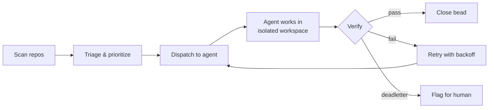
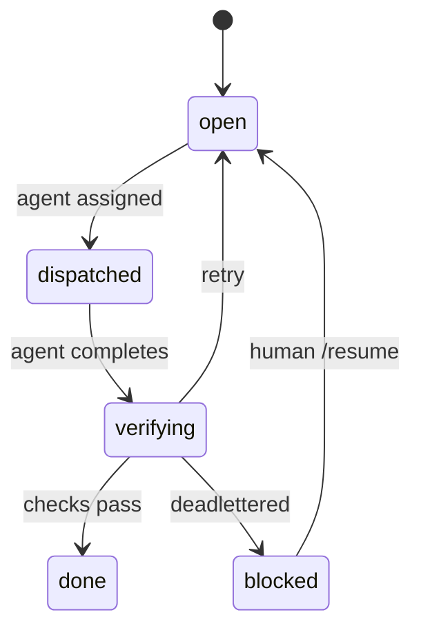

# rosary

Autonomous work orchestrator for AI agents across multiple code repos.

Rosary structures work as **beads** — small, trackable units stored in each repo via [Dolt](https://www.dolthub.com/). A reconciliation loop scans for ready beads, dispatches AI agents (Claude, Gemini) to execute them in isolated workspaces, verifies the results, and syncs status to [Linear](https://linear.app) for human review.

The human reviews 5-10 feature PRs a day. The agents handle the atoms.

## How it works



### Bead lifecycle



## Issue tracking with beads

Work items live in each repo as [beads](https://github.com/steveyegge/beads) — an AI-native issue tracker backed by Dolt (version-controlled SQL). Rosary reads and writes beads directly over MySQL, no CLI shelling.

```bash
# Beads are managed via rosary's MCP tools or CLI:
rsry bead create "Fix auth bug" --priority 1 --type bug
rsry bead list
rsry bead search "auth"
rsry bead close rsry-abc123
```

## Getting started

```bash
task build    # requires Task (taskfile.dev)
task test

# Register repos to watch
rsry enable ~/code/my-app
rsry enable ~/code/my-lib

# See what's ready
rsry status

# Dry run — see what would be dispatched
rsry run --once --dry-run

# Real run — dispatch agents, verify, close
rsry run --once --concurrency 3

# Continuous loop
rsry run
```

> Use `task build` / `task test` instead of raw `cargo` — the Taskfile sets `PKG_CONFIG_PATH` for the fuse-t dependency via ley-line.

## MCP server

Rosary exposes its full API as MCP tools. Any AI agent or human with an MCP client can scan beads, dispatch work, and track progress.

```bash
# Add to Claude Code (one-time)
claude mcp add -s user rsry -- rsry serve --transport stdio

# Or run as HTTP server
rsry serve --transport http --port 8383
```

**Tools:** `rsry_scan`, `rsry_status`, `rsry_list_beads`, `rsry_run_once`, `rsry_bead_create`, `rsry_bead_close`, `rsry_bead_comment`, `rsry_bead_search`, `rsry_dispatch`, `rsry_active`

## Config

```toml
# ~/.rsry/config.toml

[[repo]]
name = "my-app"
path = "~/code/my-app"

[[repo]]
name = "my-lib"
path = "~/code/my-lib"

[linear]
team = "ENG"

[compute]
backend = "local"   # or "sprites" for remote containers
```

## Compute providers

Agents run in isolated workspaces (jj preferred, git worktree fallback). The compute backend is pluggable:

| Provider | What | Config |
|----------|------|--------|
| `local` | Host subprocess (default) | none |
| `sprites` | [sprites.dev](https://sprites.dev) containers | `SPRITES_TOKEN` env var |

## Linear integration

Bidirectional sync — beads are source of truth, Linear is the UI.

```bash
rsry sync --dry-run    # preview
rsry sync              # push + pull + reconcile
```

Webhooks for real-time updates: `rsry serve --transport http` exposes `/webhook`.

## Verification

After an agent completes, rosary runs tiered checks:

1. Did it commit something?
2. Does it compile?
3. Do tests pass?
4. Does the linter approve?
5. Is the diff a reasonable size?

Failed checks trigger retry with backoff. After 5 failures or 3 regressions, the bead is deadlettered for human attention.

## Self-management

Rosary manages its own development. It scans its own repo, dispatches agents to fix its own bugs, and verifies the results. The plumbing works — proving it at scale is ongoing.

## Architecture

See [docs/ARCHITECTURE.md](docs/ARCHITECTURE.md) for the full technical picture.

## Build

```bash
task build     # debug build with fuse-t support
task test      # run tests
task lint      # fmt + clippy
task all       # fmt + check + lint + test
```

Pre-commit hooks enforce `cargo fmt` and `cargo clippy` on every commit.

## License

[Apache-2.0](LICENSE)
