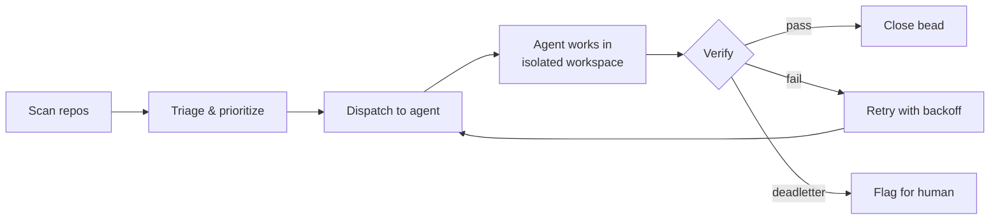
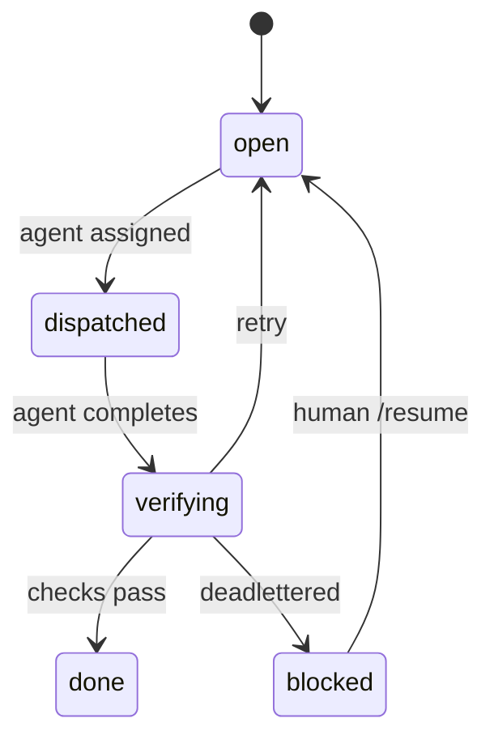

# rosary

> **Experimental software.** APIs, schemas, and behaviors change without notice. Use at your own risk. Contributions welcome — expect rough edges.

Autonomous work orchestrator for AI agents across multiple code repos. Local-first, open source.

Rosary structures work as **[beads](https://github.com/steveyegge/beads)** — small, trackable units stored in each repo via [Dolt](https://www.dolthub.com/). A reconciliation loop scans for ready beads, dispatches AI agents (Claude, Gemini) to execute them in isolated workspaces, verifies the results, and syncs status to [Linear](https://linear.app) for human review.

The human reviews 5-10 feature PRs a day. The agents handle the atoms.

## How it works


```mermaid
graph LR
    A[Scan repos] --> B[Triage & prioritize]
    B --> C[Dispatch to agent]
    C --> D[Agent works in<br/>isolated workspace]
    D --> E{Verify}
    E -->|pass| F[Close bead]
    E -->|fail| G[Retry with backoff]
    E -->|deadletter| H[Flag for human]
    G --> C
```

### Bead lifecycle


```mermaid
stateDiagram-v2
    [*] --> open
    open --> dispatched: agent assigned
    dispatched --> verifying: agent completes
    verifying --> done: checks pass
    verifying --> open: retry
    verifying --> blocked: deadlettered
    blocked --> open: human /resume
```

## Issue tracking with beads

Work items live in each repo as beads — an AI-native issue tracker backed by Dolt (version-controlled SQL). Rosary reads and writes beads directly over MySQL, no CLI shelling.

Beads are organized into **threads** (ordered progressions of related work) and **decades** (ADR-level groupings) via the BDR harmony lattice.

```bash
# Beads are managed via rosary's MCP tools or CLI:
rsry bead create "Fix auth bug" --priority 1 --issue-type bug --files src/auth.rs
rsry bead list
rsry bead search "auth"
rsry bead close rsry-abc123          # requires a verifiable test command in the description
rsry bead close rsry-abc123 --force  # override (legacy / non-impl beads)
```

### Capture beads from any provenance

```bash
# Transcript → BeadSpecs (Session provenance)
rsry capture --from-session sessions/2026-04-29.md --commit

# Source file → BeadSpecs (Code provenance, optionally scoped to a symbol)
rsry capture --from-code rosary src/bead.rs --symbol BeadSpec --commit

# Markdown ADR → beads + Rust stubs for design review
rsry decompose docs/adr/0009-feature.md --stub-output .
```

## Getting started

```bash
task build    # requires Task (taskfile.dev)
task test

# Register repos to watch
rsry enable ~/code/my-app
rsry enable ~/code/my-lib

# See what's ready
rsry status

# Dry run — see what would be dispatched
rsry run --once --dry-run

# Real run — dispatch agents, verify, close
rsry run --once --concurrency 3

# Continuous loop
rsry run
```

> Use `task build` / `task test` instead of raw `cargo` — the Taskfile sets `PKG_CONFIG_PATH` for the fuse-t dependency via ley-line.

## MCP server

Rosary exposes 31 tools as MCP. Any AI agent or human with an MCP client can scan beads, dispatch work, manage threads, and track progress.

```bash
# Add to Claude Code (one-time)
claude mcp add -s user rsry -- rsry serve --transport stdio

# Or run as HTTP server
rsry serve --transport http --port 8383
```

**31 tools** across six categories:

| Category   | Tools                                                                                                                                              |
| ---------- | -------------------------------------------------------------------------------------------------------------------------------------------------- |
| Beads      | `rsry_bead_create`, `rsry_bead_update`, `rsry_bead_search`, `rsry_bead_close`, `rsry_bead_link`, `rsry_bead_import`                                |
| Comments   | `rsry_bead_comment`, `rsry_bead_comment_list`, `rsry_bead_comment_update`, `rsry_bead_comment_delete` (audit-trail preserved; hard-delete CLI-only)|
| Status     | `rsry_status`, `rsry_list_beads`, `rsry_scan`, `rsry_active`                                                                                       |
| Dispatch   | `rsry_dispatch`, `rsry_run_once`, `rsry_decompose`, `rsry_pipeline_upsert`, `rsry_pipeline_query`, `rsry_dispatch_record`, `rsry_dispatch_history` |
| Workspaces | `rsry_workspace_create`, `rsry_workspace_checkpoint`, `rsry_workspace_cleanup`, `rsry_workspace_merge`                                             |
| Hierarchy  | `rsry_decade_list`, `rsry_thread_list`, `rsry_thread_assign`, `rsry_thread_reparent`                                                               |
| Repos      | `rsry_repo_register`, `rsry_repo_list`                                                                                                             |

## Config

See [docs/CONFIGURATION.md](docs/CONFIGURATION.md) for the full reference.

```toml
# ~/.rsry/config.toml

[[repo]]
name = "my-app"
path = "~/code/my-app"

[[repo]]
name = "my-lib"
path = "~/code/my-lib"

[linear]
team = "ENG"

[backend]
provider = "dolt"
path = "~/.rsry/dolt/rosary"

[compute]
backend = "local"   # or "sprites" for remote containers
```

## Compute providers

Agents run in isolated workspaces (jj preferred, git worktree fallback). The compute backend is pluggable:

| Provider  | What                                          | Config                  |
| --------- | --------------------------------------------- | ----------------------- |
| `local`   | Host subprocess (default)                     | none                    |
| `sprites` | [sprites.dev](https://sprites.dev) containers | `SPRITES_TOKEN` env var |

## Linear integration

Bidirectional sync — beads are source of truth, Linear is the UI. Threaded beads sync as sub-issues.

```bash
rsry sync --dry-run    # preview
rsry sync              # push + pull + reconcile
```

Webhooks for real-time updates: `rsry serve --transport http` exposes:
- `/webhook` — Linear bead status sync
- `/webhook/github` — GitHub merge events advance the linked bead and unblock dependents

## GitHub integration

```bash
rsry sync --github     # mirror bead context (id, title, status, file scopes) to PR comments
```

The merge webhook closes the bead and unblocks its dependents when the linked PR lands.

## Encrypted notes (scoped, per-host)

Notes live under `notes/<scope>/` encrypted with [age](https://age-encryption.org/). Each scope has a `.recipients` file listing the public keys allowed to decrypt. Different machines see different scopes naturally because they hold different unwrap keys.

```bash
# Re-encrypt every note in `notes/work/` for an updated recipient list
rsry notes rotate --scope work --add-recipient age1abc...
```

Refuses to rotate to an empty recipient list (would brick the scope). Atomic writes — partial failures don't corrupt files.

## Plugin system

Plugins extend rosary along a `kind` axis declared in `~/.rsry/plugins/*.toml` or `<repo>/.rosary/plugins/*.toml`:

| Kind         | Purpose                                                                |
| ------------ | ---------------------------------------------------------------------- |
| `hook`       | Pipeline hook (default) — runs at `pipeline.triage` / `verify` / `close` |
| `mcp`        | Outbound MCP server — rosary connects as a client (planned)            |
| `dispatch`   | Alternative `AgentProvider` (e.g. local model, sprites)                |
| `state_sink` | Mirrors bead state to an external system (planned)                     |

Verify-tier plugins can return a `coverage: f64`. When a bead has `doc_coverage_min` in its success criteria, rosary fails the gate if the plugin reports coverage below the threshold (e.g. `assay` for doc-coverage delta).

```bash
# File P3 chore beads for stale markdown→code refs reported by `assay.scan` plugins
rsry scan --assay
```

## Verification

After an agent completes, rosary runs tiered checks:

1. Did it commit something?
1. Does it compile?
1. Do tests pass?
1. Does the linter approve?
1. Is the diff a reasonable size?

Failed checks trigger retry with backoff. After 5 failures or 3 regressions, the bead is deadlettered for human attention.

## Self-management

Rosary manages its own development. It scans its own repo, dispatches agents to fix its own bugs, and verifies the results. The plumbing works — proving it at scale is ongoing.

## Architecture

See [docs/ARCHITECTURE.md](docs/ARCHITECTURE.md) for the full technical picture, [docs/CONFIGURATION.md](docs/CONFIGURATION.md) for config reference, and [docs/glossary.md](docs/glossary.md) for terminology (beads, decades, threads, triage, etc.).

## Build

```bash
task build     # debug build with fuse-t support
task test      # run tests
task lint      # fmt + clippy
task all       # fmt + check + lint + test
```

Pre-commit hooks enforce `cargo fmt` and `cargo clippy` on every commit.

**Build prereqs:**

- Rust toolchain (`rustup`) and `cargo`
- The `capnp` schema compiler (`brew install capnp` / `apt-get install capnproto`)
  — `build.rs` invokes it to generate Rust bindings from `schemas/cloister.capnp`.

## Building the image

`task image` produces a distroless OCI image tagged `rosary:0.2.0` — the
exact tag cloister's `cluster.capnp` pins for the `rosary` bundle. The
image's default `CMD` matches cluster.capnp's launch args
(`mcp --ipc-socket /run/cloister-uds/rosary.sock`).

```bash
task image          # krust musl cross-compile + docker COPY
task image:smoke    # verify the binary runs inside the distroless image
```

The pipeline is two steps:

1. **krust + cargo-zigbuild** cross-compiles `rsry` to
   `aarch64-unknown-linux-musl` (`target/krust/.../release/rsry`, ~19MB
   static).
2. **`image.Dockerfile`** drops that binary onto
   `gcr.io/distroless/static-debian12:nonroot` (no shell, no package
   manager, nonroot uid 65532) — a single `COPY`, no Rust toolchain in
   the container.

Pattern adopted from `ley-line-open` after its melange/apko path stalled
on Apple Silicon (precedent: `ley-line-open-2b255c`). The `melange.yaml`
and `apko.yaml` files are retained for reference; `task apk` still wires
them but is no longer the recommended path.

## License

[AGPL-3.0](LICENSE)
