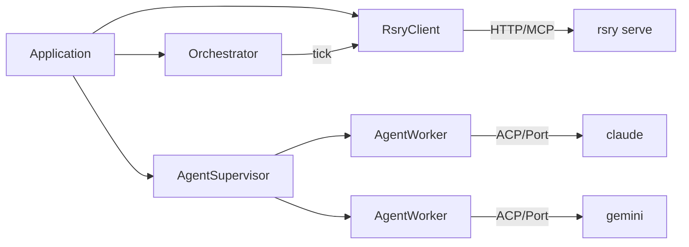

# Conductor

Durable, headless agent orchestration via OTP. The persistent version of Claude Code's agent teams.



## What It Does

1. **Polls** rosary for open beads via MCP tools
2. **Triages** by priority (P0-P2, skip epics)
3. **Dispatches** agents via ACP protocol — not `claude -p` shell-out
4. **Supervises** via OTP — instant completion detection, no polling
5. **Advances** pipelines: dev-agent → staging-agent → prod-agent
6. **Retries** with exponential backoff, deadletters after max attempts
7. **Survives** crashes — OTP supervision tree outlives the orchestrator

## Quick Start

```bash
# 1. Start rosary's HTTP server
rsry serve --transport http --port 8383 &

# 2. Start conductor
cd conductor && mix deps.get && mix run --no-halt

# 3. Or interactive
iex -S mix
Conductor.status()
Conductor.dispatch("rsry-abc123", "/path/to/repo", issue_type: "bug")
Conductor.agents()
```

## Why Not claude -p?

| | `claude -p` | ACP over Port |
|---|---|---|
| Exit codes | Only on completion | Real-time |
| Permissions | CLI flag strings | Protocol callbacks |
| Mid-execution | Blind | Structured events |
| Session resume | `--resume sid` | Built into protocol |
| Multi-provider | Separate CLI per provider | Same protocol |

ACP (Agent Client Protocol) is JSON-RPC over stdio. The conductor speaks it natively to any ACP-compatible binary — Claude, Gemini, custom agents. Permission decisions happen in Elixir code, not CLI strings. This is the foundation for signed policy bundles (sigpol).

## Pipelines

Pipelines are closures — they capture the full execution plan and survive crashes:

```elixir
p = Pipeline.for_bead("rsry-abc", "/repo", "bug")
# => steps: [%Step{agent: "dev-agent", timeout: 600s, retries: 3},
#             %Step{agent: "staging-agent", timeout: 600s, retries: 2}]

Pipeline.current_agent(p)                    # "dev-agent"
Pipeline.advance(p)                          # {:next, %Pipeline{current: 1}}
Pipeline.insert_step(p, 1, %{agent: "qa"})  # runtime mutation
Pipeline.to_map(p) |> Jason.encode!()        # serialize for Dolt
Pipeline.from_map(saved)                     # recover after crash
```

Default pipelines by issue type:

| Type | Pipeline |
|------|----------|
| bug | dev-agent → staging-agent |
| feature | dev-agent → staging-agent → prod-agent |
| task/chore | dev-agent |
| review | staging-agent |
| epic/design/research | pm-agent |

## Configuration

```elixir
# config/config.exs
config :conductor,
  rsry_url: "http://127.0.0.1:8383/mcp",
  scan_interval_ms: 30_000,        # orchestrator tick interval
  agent_timeout_ms: 600_000,       # 10 min per agent phase
  max_concurrent: 3,               # DynamicSupervisor max_children
  agent_provider: "claude"         # ACP binary: "claude", "gemini", etc.
```

## Testing

```bash
mix test              # 38 unit tests (rsry not required)
mix test --include integration  # + integration tests (requires rsry serve)
```

Tests use injectable `spawn_fn` and `MockRsry` — no real agents spawned in unit tests.

## Relation to Rosary

Conductor is the **control plane**. Rosary is the **data plane**.

| Concern | Owner |
|---------|-------|
| Triage scoring, dedup, severity floors | Rosary (Rust) |
| Agent process lifecycle | Conductor (Elixir) |
| Dolt persistence, Linear sync | Rosary (Rust) |
| Permission evaluation | Conductor (Elixir) |
| Verification pipeline | Rosary (Rust) |
| Phase advancement | Conductor (Elixir) |
| BDR decomposition | Rosary (Rust) |
| Pipeline state machine | Conductor (Elixir) |

## Design

- [ADR-002](ADR-002-otp-conductor.md) — full design rationale, Symphony comparison, migration plan
- [docs/ARCHITECTURE.md](docs/ARCHITECTURE.md) — module relationships and data flow
