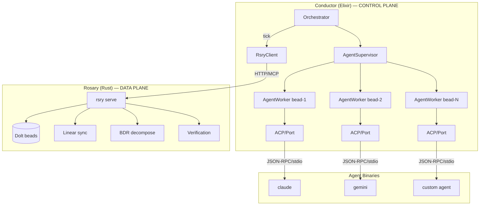
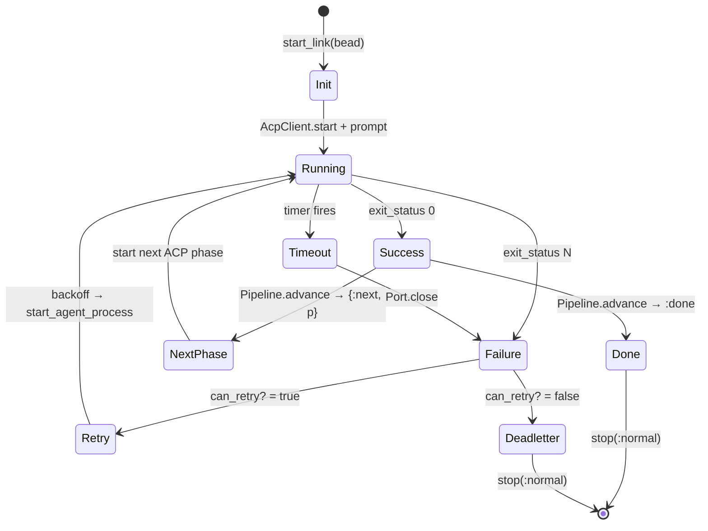
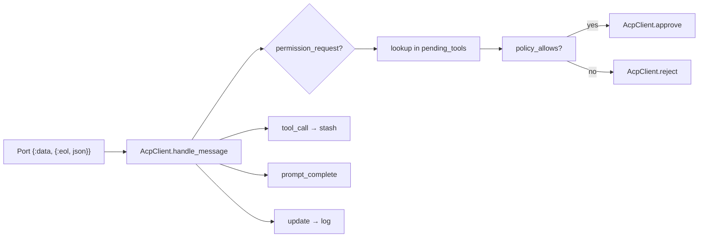
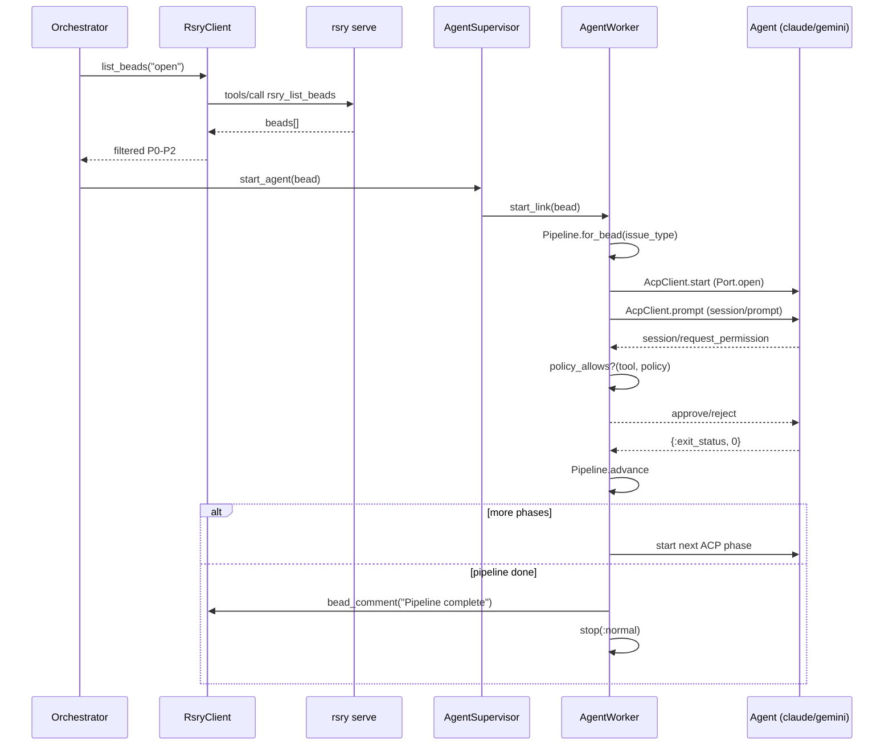
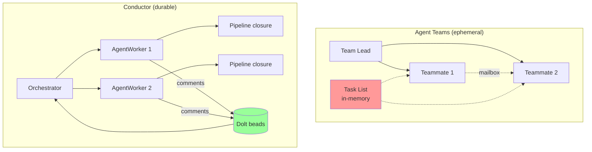
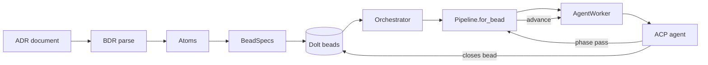

# Conductor Architecture

## Overview

Conductor is an Elixir/OTP application that manages agent process lifecycles for rosary. It replaces the hand-rolled process supervision in Rust's `reconcile.rs` with BEAM primitives.



## Modules

### Conductor.Application
OTP Application supervisor. Starts children in order:
1. `RsryClient` — must connect before anything dispatches
2. `AgentSupervisor` — ready to accept workers
3. `Orchestrator` — starts ticking

### Conductor.RsryClient
GenServer maintaining an HTTP/MCP session to `rsry serve --transport http`.

- JSON-RPC over HTTP with `Mcp-Session-Id` for session continuity
- Auto-reconnects on session loss (exponential backoff, max 5 attempts)
- Wraps all 11 rsry MCP tools as Elixir functions
- Implements `@behaviour` for test doubles

### Conductor.Orchestrator
GenServer with a self-correcting timer (`Process.send_after`).

Each tick:
1. Query open beads via `RsryClient.list_beads("open")`
2. Filter: P0-P2, skip epics, skip already-dispatched
3. Fill available slots up to `max_concurrent`
4. Start `AgentWorker` via `AgentSupervisor`

### Conductor.AgentSupervisor
`DynamicSupervisor` with `strategy: :one_for_one`.

- `max_children` from config (default 3)
- Workers use `restart: :temporary` — no auto-restart, orchestrator decides
- Each worker is an independent failure domain

### Conductor.AgentWorker
GenServer managing one bead's full pipeline. The core of the system.

**State**: holds a `Pipeline` struct (the closure), Port handle, OS PID, timeout timer.

**Lifecycle**:



**ACP message handling**:



**Why ACP, not claude -p**:
- Real exit codes from Port (not approximated)
- Permission callbacks evaluated in Elixir (not CLI flag strings)
- Structured mid-execution events (not blind)
- Provider-agnostic (Claude, Gemini, any ACP binary)
- Foundation for sigpol signed permission bundles

### Conductor.AcpClient
ACP (Agent Client Protocol) client over Erlang Port.

- `start/3` — spawn binary, send `initialize`
- `prompt/4` — create session, send prompt
- `handle_message/1` — parse JSON-RPC into typed events
- `approve/reject` — respond to permission callbacks
- `policy_allows?/2` — local permission check (sigpol foundation)
- `policy_for/1` — map issue_type to permission level

### Conductor.Pipeline
First-class pipeline struct — the agent path as a closure.

A Pipeline captures:
- **Steps**: ordered list of `{agent, timeout, max_retries}`
- **Current**: index into steps
- **History**: timestamped outcomes per phase
- **Context**: bead_id, repo, issue_type

Operations:
- `for_bead/3,4` — construct from issue_type (or resume at a specific agent)
- `advance/1` — move to next step, returns `:done` or `{:next, pipeline}`
- `record/2,3` — append outcome to history
- `can_retry?/1` — check retry budget
- `insert_step/3`, `append_step/2` — runtime mutation
- `to_map/1`, `from_map/1` — serialize for Dolt persistence

### Conductor.Pipeline.Step
Individual step in a pipeline. Fields: `agent`, `timeout_ms`, `max_retries`.

## Data Flow

### Dispatch



### Permission Evaluation

```mermaid
flowchart TD
    IT[issue_type] --> PF[policy_for]
    PF --> RO[:read_only]
    PF --> IM[:implement]
    PF --> PL[:plan]

    RO --> Check{tool name?}
    IM --> Check
    PL --> Check

    Check -->|Read/Glob/Grep| Allow[Approve]
    Check -->|mcp__mache__*| Allow
    Check -->|mcp__rsry__*| Allow
    Check -->|Edit/Write| ImplOnly{:implement?}
    Check -->|Bash(...)| ImplOnly
    ImplOnly -->|yes| Allow
    ImplOnly -->|no| Deny[Reject]
```

## Comparison to Claude Code Agent Teams

Conductor is the durable, headless version of Claude Code's interactive agent teams:

| Agent Teams (interactive) | Conductor (headless) |
|---|---|
| Team lead coordinates | Orchestrator GenServer |
| Shared task list | Beads in Dolt |
| Teammates = Claude instances | AgentWorker GenServers |
| Task deps (pending → unblocked) | Pipeline steps + bead depends_on |
| TeammateIdle hook | GenServer `:exit_status` |
| TaskCompleted hook | `on_success` → `Pipeline.advance` |
| Mailbox messaging | Bead comments via rsry MCP |
| Plan approval gates | Pipeline step with `mode: :plan_first` |
| Session-scoped, dies on exit | Dolt-persisted, survives crashes |
| Permissions inherit from lead | Per-step policy via ACP callbacks |
| One team per session | Multiple concurrent pipelines |
| No session resumption | Pipeline state recovered from Dolt |

### What conductor adds beyond agent teams



**Durable state**: agent teams store tasks in `~/.claude/tasks/{team-name}/` — ephemeral, lost on session exit. Conductor persists pipeline state to Dolt, surviving crashes and restarts.

**Plan approval**: agent teams support `require plan approval` as a lead instruction. Conductor can model this as a pipeline step mode:

```elixir
# Future: plan-first step requires review before implementation
%Step{agent: "dev-agent", mode: :plan_first, timeout_ms: 600_000}

# The worker would:
# 1. Dispatch agent with :read_only permissions
# 2. Agent produces a plan (not code)
# 3. Worker evaluates plan (or sends to lead for approval)
# 4. If approved: re-dispatch with :implement permissions
```

**Competing hypotheses**: agent teams dispatch multiple teammates exploring different theories. Conductor can model this as a parallel pipeline:

```elixir
# Future: parallel steps dispatched simultaneously
%Pipeline{steps: [
  %Step{agent: "dev-agent", parallel_group: :investigation},
  %Step{agent: "staging-agent", parallel_group: :investigation},
  %Step{agent: "prod-agent", parallel_group: :review},  # runs after investigation group
]}
```

**Inter-agent communication**: agent teams use a mailbox. Conductor uses bead comments — visible to all agents via rsry MCP, persisted in Dolt, and inspectable by humans in Linear.

## Relation to BDR

BDR decomposes ADRs into beads (top-down planning). The conductor dispatches agents to work on those beads (execution). The flow:



BDR's accrete module tracks decade/thread completion — the conductor's phase advancement feeds into this. When all beads in a thread complete their pipelines, accrete transitions the decade status.

## Testing Strategy

- **Unit tests** (38): Pipeline logic, worker lifecycle, orchestrator triage. Use `spawn_fn` injection and `MockRsry` — no real agents, no rsry needed.
- **Integration tests** (14, excluded by default): Full supervision tree, RsryClient against real rsry, pipeline roundtrip.
- **E2E**: `mix test --include integration` with `rsry serve` running.

## Configuration

```elixir
config :conductor,
  rsry_url: "http://127.0.0.1:8383/mcp",   # rosary MCP endpoint
  scan_interval_ms: 30_000,                  # orchestrator tick
  agent_timeout_ms: 600_000,                 # 10 min per phase
  max_concurrent: 3,                         # concurrent agents
  agent_provider: "claude",                  # ACP binary name
  rsry_client_mod: Conductor.RsryClient,     # injectable for tests
  agent_spawn_fn: nil                        # injectable for tests
```
