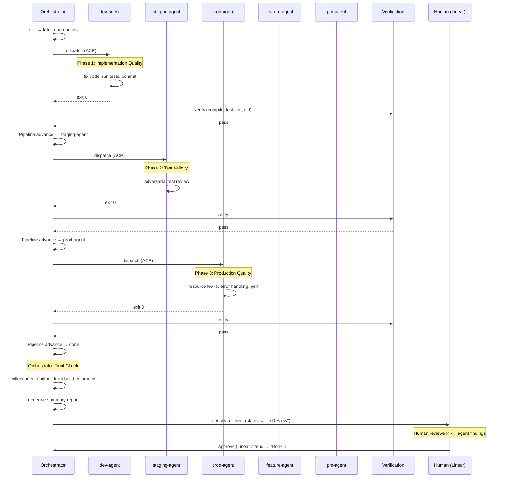

# Bead Lifecycle: Dispatch → Pipeline → Review

The full loop from bead creation to human review.

## Pipeline Stages

| Stage | Agent | What it checks | Permission | Validation |
|-------|-------|----------------|------------|------------|
| 1 | dev-agent | Complexity, dead code, TODOs, hardcoded values | :implement | `task test` every 5min |
| 2 | staging-agent | Fake tests, mock abuse, coverage gaps | :read_only | `task test` every 5min |
| 3 | prod-agent | Resource leaks, error swallowing, concurrency | :read_only | `task test` every 5min |
| 4 | feature-agent | Circular deps, scattered functionality, API drift | :read_only | — |
| 5 | pm-agent | Cross-repo coherence, scope creep, abandoned work | :plan | — |

Not all beads go through all 5 stages. Pipeline templates by issue type:

| Type | Pipeline |
|------|----------|
| bug | dev → staging |
| feature | dev → staging → prod |
| task/chore | dev |
| review | staging |
| epic/design/research | pm |

## Orchestrator Final Check

After the pipeline completes, the orchestrator:

1. **Collects findings** — reads all bead comments from each agent phase
2. **Checks Golden Rules** — validates rule compliance (Rule 6: validate recursively)
3. **Generates report** — summary of what each agent found/changed
4. **Updates Linear** — moves issue to "In Review" with the report
5. **Waits for human** — the human reviews the PR + agent findings

The human sees:
- The code changes (PR diff)
- Each agent's findings (bead comments)
- The verification results (compile/test/lint per phase)
- The pipeline history (which agents passed, retries, timing)

## Rule 6: Self-Validation

The release gate for rosary itself is this same loop. Rosary dispatches agents to work on rosary beads, through the full pipeline, proving the methodology by using it. If the system can't orchestrate its own development, it's not ready to orchestrate anyone else's.

The `self_managed: true` flag in config marks rosary as its own subject. The conductor treats it like any other repo — but the meta-level validation is: **the tool works because it built itself**.
