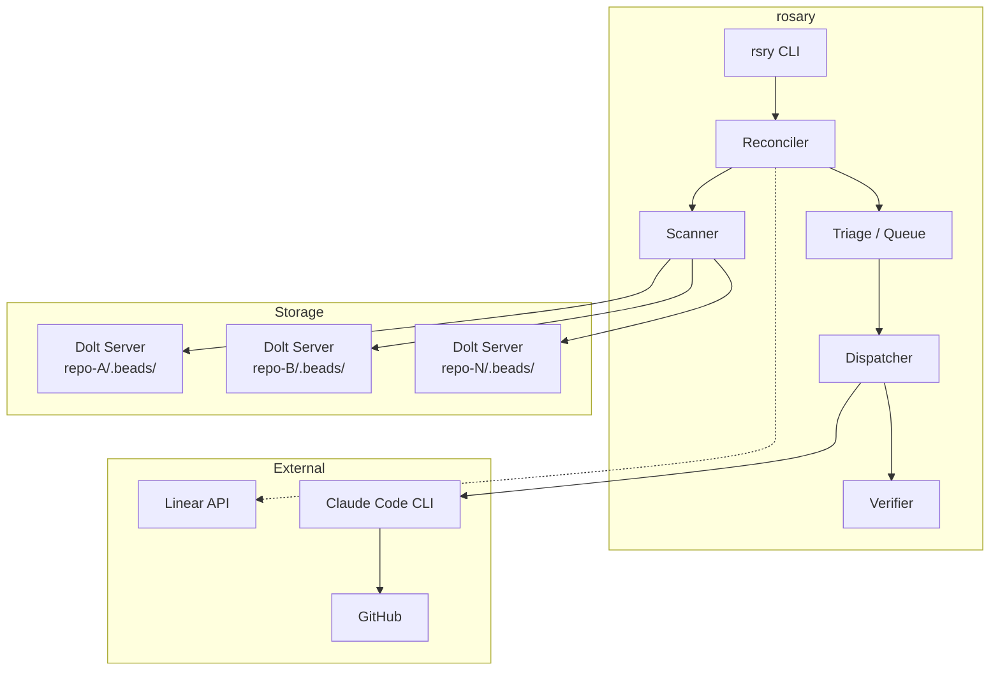
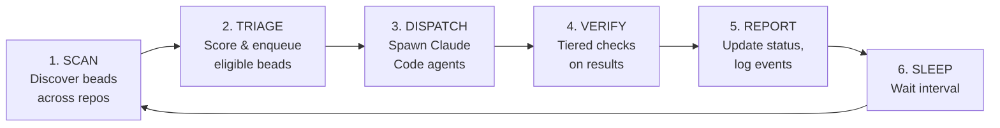
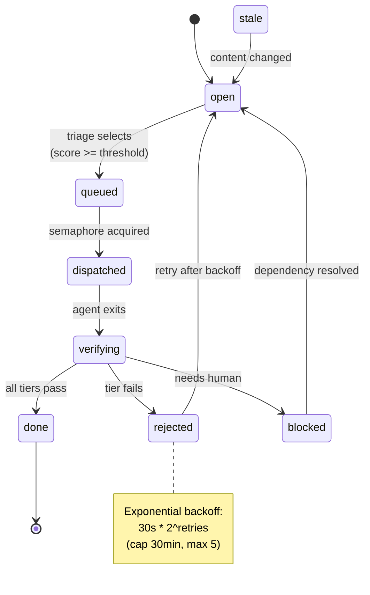
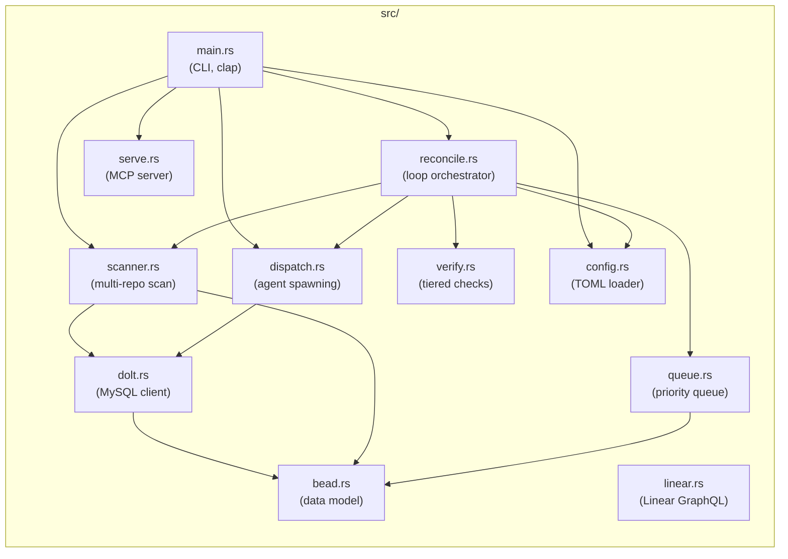
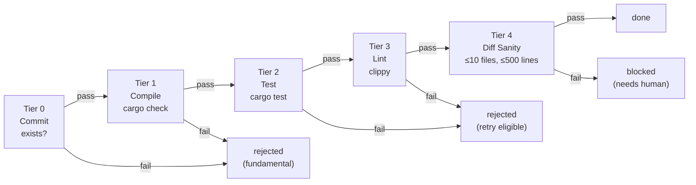
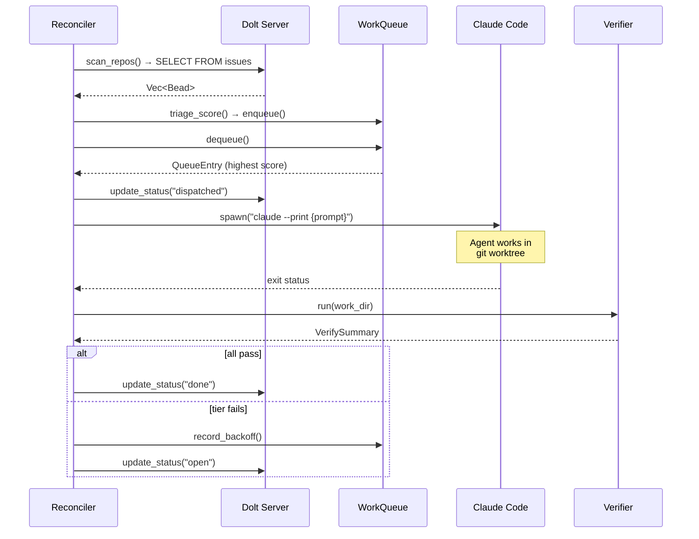
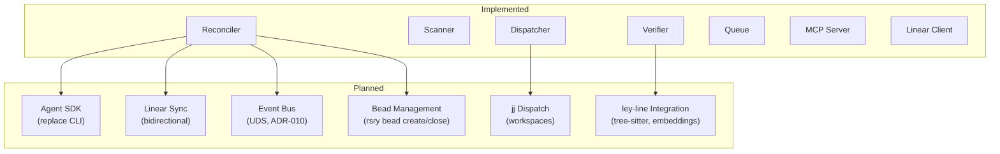

# Rosary Architecture

Rosary is a cross-repo task orchestrator that strings beads (per-repo work items), Linear tickets, and review layers into coordinated autonomous development work.

## System Overview



## Reconciliation Loop

The core of rosary is a Kubernetes-controller-style desired-state loop. Every iteration:



## Bead State Machine

Each bead follows a Labeled Transition System with 8 states:



## Module Layout



## Triage Scoring

Beads are scored with a weighted composite to determine dispatch priority:

```
score = 0.4 * priority_score    # P0=1.0, P4=0.2
      + 0.3 * dependency_score  # 1.0 if ready, 0.0 if blocked
      + 0.2 * age_score         # linear ramp over 1 week
      + 0.1 * retry_penalty     # 1/(1+retries)
```

Higher score = dispatched first. Beads in backoff are skipped until `not_before` expires.

## Verification Pipeline

Five tiers run in sequence; first failure short-circuits:



Language-aware: Rust gets `cargo check/test/clippy`, Go gets `go vet/test/golangci-lint`.

## Stopping Conditions

| Condition | Default | Scope |
|-----------|---------|-------|
| Max retries per bead | 5 | Per-bead, then deadletter |
| Consecutive reverts | 3 | Per-bead, then deadletter |
| Agent timeout | 10 min | Per-dispatch, kill process |

A "revert" is when `highest_passing_tier` drops below its previous value after a dispatch. Three consecutive reverts means the agent is making things worse.

## Data Flow



## Dolt Connection Model

Each repo has a `.beads/` directory with a running Dolt server:

```
repo/.beads/
├── dolt-server.port     # TCP port (e.g., 53214)
├── metadata.json        # {"dolt_database": "rosary", ...}
├── dolt/                # Dolt data directory
│   └── (versioned SQL database)
├── config.yaml          # bd configuration
└── interactions.jsonl   # agent interaction log
```

Rosary connects via native MySQL wire protocol: `mysql://root@127.0.0.1:{port}/{database}`

Key tables: `issues` (51 columns), `dependencies`, `comments`, `events`

## Configuration

`rosary.toml` declares repos to manage:

```toml
[[repo]]
name = "rosary"
path = "~/remotes/art/rosary"
lang = "rust"
self = true  # dogfooding flag

[[repo]]
name = "mache"
path = "~/remotes/art/mache"
lang = "go"
```

## CLI Commands

| Command | Status | Description |
|---------|--------|-------------|
| `rsry scan` | Working | Discover beads across repos via Dolt |
| `rsry status` | Working | Aggregate view across repos |
| `rsry dispatch <id>` | Working | Spawn Claude Code for a single bead |
| `rsry run` | Working | Full reconciliation loop |
| `rsry run --once --dry-run` | Working | Single pass, print without spawning |
| `rsry plan <ticket>` | Working | Fetch Linear ticket details |
| `rsry sync` | Working | List open Linear issues (read-only) |
| `rsry serve` | Working | MCP server (stdio transport) |

## Design Influences

- **Kubernetes controllers**: Desired state vs actual state, reconciliation loop, generation tracking
- **driftlessaf** (Chainguard): Workqueue with priority, NotBefore scheduling, exponential backoff, provider overlay pattern
- **gem** (sibling repo): Tiered deterministic evaluation, consecutive-revert stopping, mode-aware dispatch
- **State machine design**: 8-state bead lifecycle with generation tracking and bounded retries

## Future Architecture


