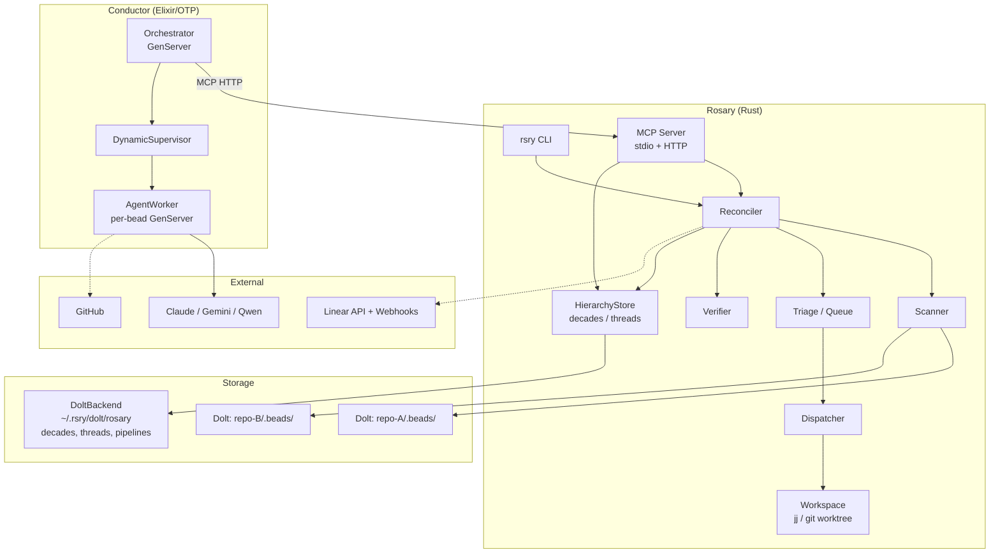
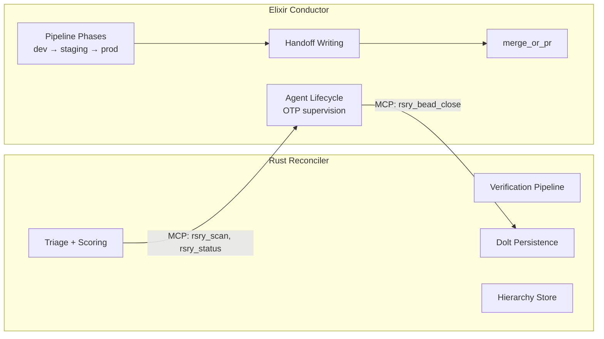
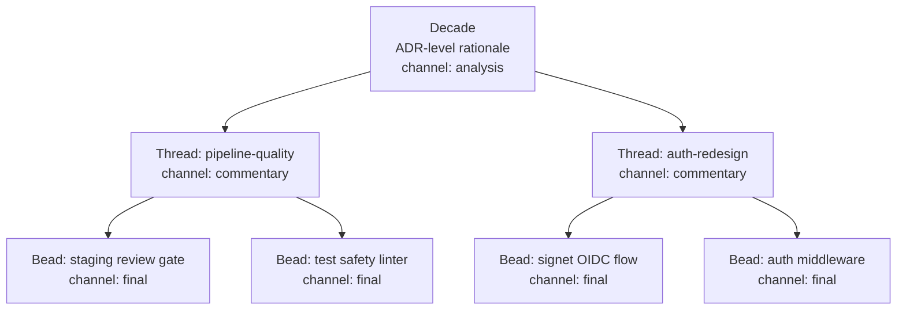
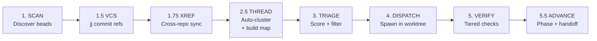
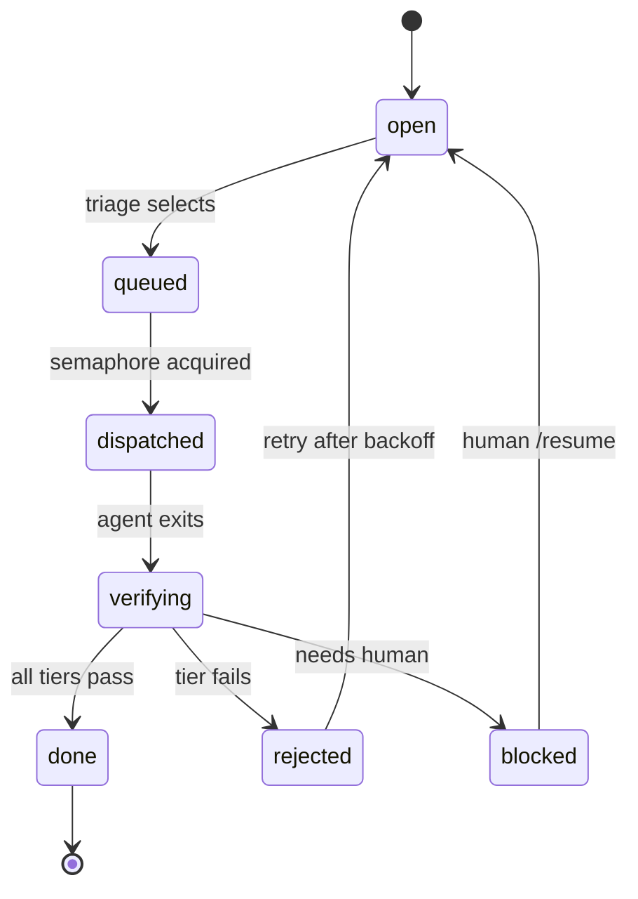
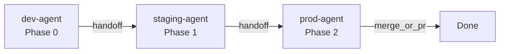
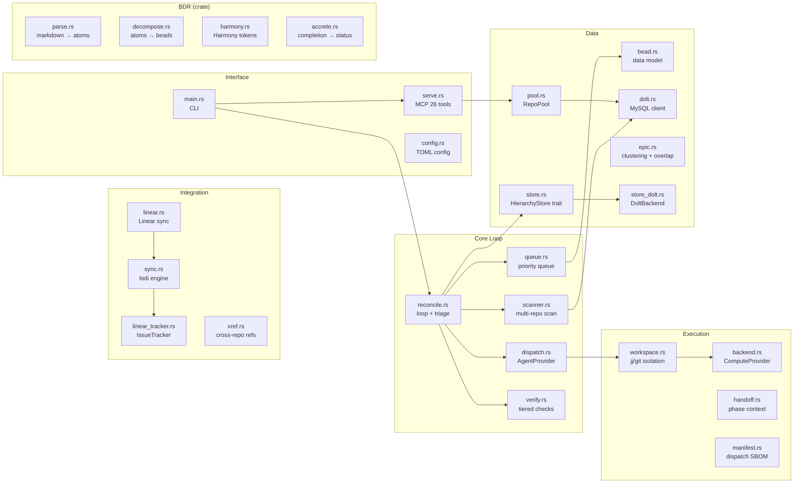
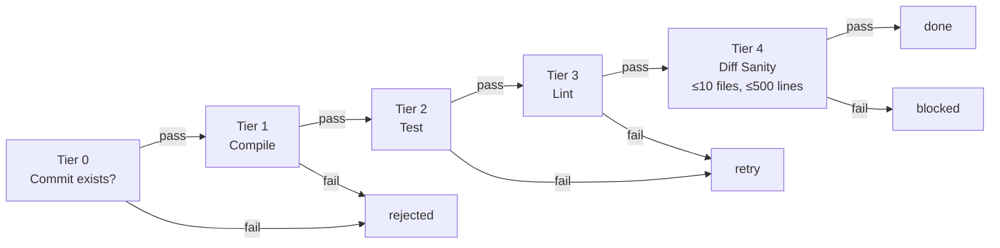
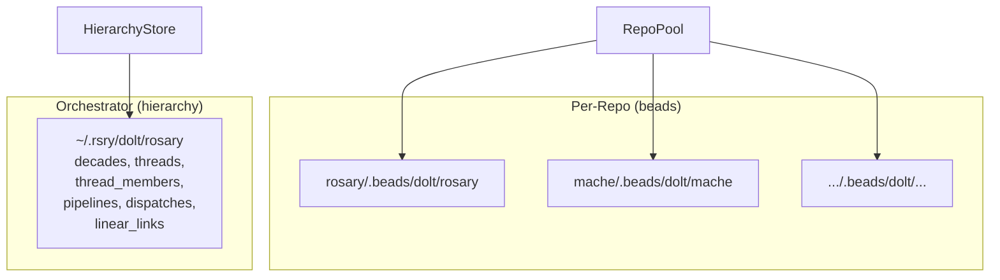

# Rosary Architecture

Rosary is a cross-repo agent orchestrator that strings beads (per-repo work items), threads (ordered progressions), and decades (ADR-level groupings) into coordinated autonomous development work.

## System Overview

## Dual Orchestrator

Rosary has two orchestration paths:

The Rust reconciler handles triage, verification, and persistence. The Elixir conductor handles agent lifecycle via OTP supervision — instant crash detection (`:DOWN` messages), automatic restart, and pipeline phase advancement as synchronous GenServer state.

## BDR Harmony Lattice

Work is organized in a 3-tier lattice matching OpenAI's Harmony channel model:

| Tier   | BDR Channel  | Visibility              | Dolt Table                   |
| ------ | ------------ | ----------------------- | ---------------------------- |
| Decade | `analysis`   | Internal (architect)    | `decades`                    |
| Thread | `commentary` | Team (developers)       | `threads` + `thread_members` |
| Bead   | `final`      | External (stakeholders) | per-repo `issues`            |

Thread-aware triage: same-thread beads are **sequenced** (dispatched in order), not **suppressed** (false dedup). The reconciler pre-computes a bead→thread map before triage to avoid async borrows.

## Reconciliation Loop

### Triage Filters (Constraint Stack)

1. State check (must be Open)
1. Severity floor (configurable min priority)
1. Skip epics (planning beads, not actionable)
1. Dependency check (blocked beads deferred)
1. Per-repo busy check (one agent per repo)
1. **Thread sequencing** (same-thread beads wait for thread-mate)
1. Semantic dedup (`epic::is_dominated_by`)
1. **File/directory overlap** (`epic::has_file_overlap` — prefix matching for directory scopes)

## Bead State Machine

## Pipeline Phase Advancement

Pipeline per issue type:

| Type            | Pipeline             |
| --------------- | -------------------- |
| bug             | dev → staging        |
| feature         | dev → staging → prod |
| task/chore      | dev                  |
| review          | staging              |
| design/research | architect            |
| epic            | pm                   |

Handoff files (`.rsry-handoff-N.json`) carry summary, files_changed, review_hints, verdict, and thread_id between phases. The workspace is **reused** across phases — each agent sees the previous agent's commits and handoff chain.

## Module Layout

## Verification Pipeline

Five tiers, first failure short-circuits:

Language-aware: Rust gets `cargo check/test/clippy`, Go gets `go vet/test/golangci-lint`.

## Dolt Connection Model

Two tiers of Dolt databases:

Connection safety: `dolt_transaction_commit=1` (auto-commit per statement), `max_connections=1` (session variable consistency), bail on known dead port (no silent empty DB).

## MCP Tools (26)

| Category   | Tools                                                                                                                                              |
| ---------- | -------------------------------------------------------------------------------------------------------------------------------------------------- |
| Beads      | `rsry_bead_create`, `rsry_bead_update`, `rsry_bead_search`, `rsry_bead_comment`, `rsry_bead_close`, `rsry_bead_link`                               |
| Status     | `rsry_status`, `rsry_list_beads`, `rsry_scan`, `rsry_active`                                                                                       |
| Dispatch   | `rsry_dispatch`, `rsry_run_once`, `rsry_decompose`, `rsry_pipeline_upsert`, `rsry_pipeline_query`, `rsry_dispatch_record`, `rsry_dispatch_history` |
| Workspaces | `rsry_workspace_create`, `rsry_workspace_checkpoint`, `rsry_workspace_cleanup`, `rsry_workspace_merge`                                             |
| Hierarchy  | `rsry_decade_list`, `rsry_thread_list`, `rsry_thread_assign`                                                                                       |

## Linear Integration

Bidirectional sync with sub-issue projection:

| BDR Tier | Linear Entity | `linear_type` |
| -------- | ------------- | ------------- |
| Decade   | Project       | —             |
| Thread   | Parent Issue  | `issue`       |
| Bead     | Sub-Issue     | `sub_issue`   |

Beads with thread assignments sync as sub-issues of the thread's parent issue. Beads without threads create flat issues (backwards compatible).

## File/Directory Scoping

All bead types require scopes for parallel dispatch:

- **Files**: `src/reconcile.rs` (exact path)
- **Directories**: `crates/bdr/` (trailing slash = prefix match)
- **Repo-wide**: `./` (blocks all dispatch in that repo)

`has_file_overlap()` uses prefix matching — `crates/bdr/` overlaps `crates/bdr/src/harmony.rs`. This enables design beads to scope to subtrees while implementation beads scope to exact files.

## Stopping Conditions

| Condition            | Default | Scope                      |
| -------------------- | ------- | -------------------------- |
| Max retries per bead | 5       | Per-bead, then deadletter  |
| Consecutive reverts  | 3       | Per-bead, then deadletter  |
| Agent timeout        | 10 min  | Per-dispatch, kill process |

## Design Influences

- **Kubernetes controllers**: desired state reconciliation, generation tracking
- **driftlessaf** (Chainguard): workqueue with priority, NotBefore scheduling, exponential backoff
- **beads** (steveyegge): AI-native issue tracking, Dolt-backed
- **OpenAI Symphony**: OTP supervision patterns, Elixir conductor
- **OpenAI Harmony**: 3-channel progressive disclosure (analysis/commentary/final → decade/thread/bead)
