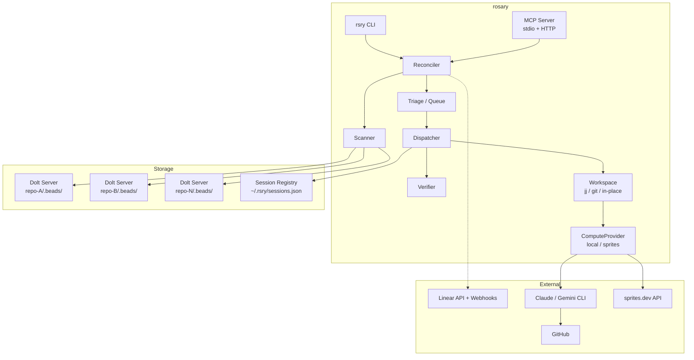
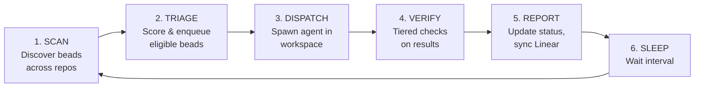
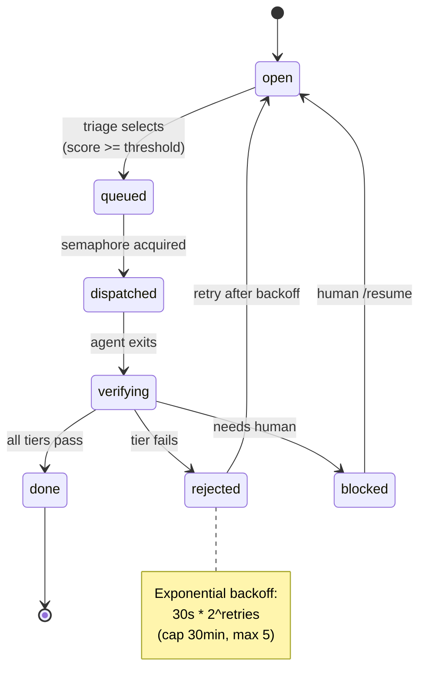
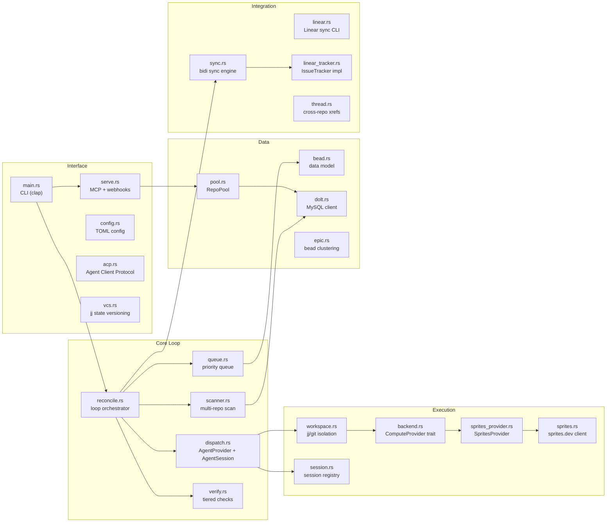
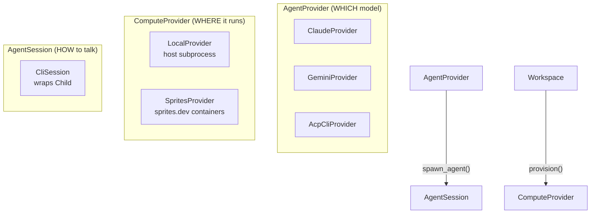
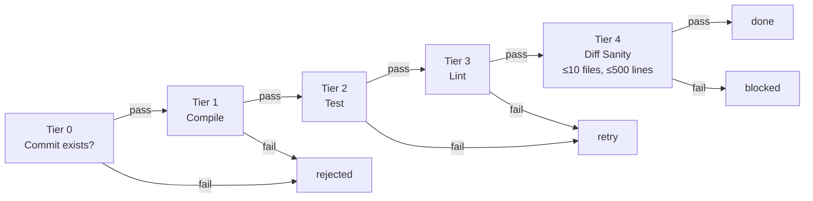
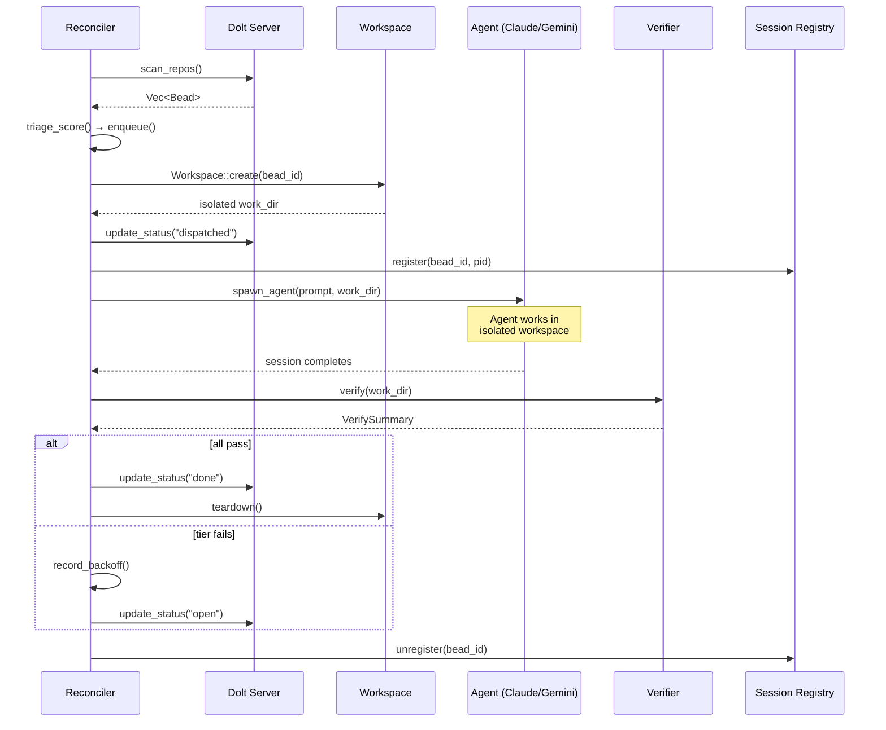

# Rosary Architecture

Rosary is a cross-repo task orchestrator that strings beads (per-repo work items), Linear tickets, and review layers into coordinated autonomous development work.

## System Overview



## Reconciliation Loop

The core is a Kubernetes-controller-style desired-state loop:



## Bead State Machine



## Module Layout



## Dispatch Architecture

Two orthogonal axes compose for agent execution:



`AgentProvider` decides the model and returns a `Box<dyn AgentSession>`.
`ComputeProvider` decides the infrastructure (local process vs remote container).
`Workspace` manages VCS isolation (jj > git worktree > in-place).

## Triage Scoring

```
score = 0.4 * priority_score    # P0=1.0, P4=0.2
      + 0.3 * dependency_score  # 1.0 if ready, 0.0 if blocked
      + 0.2 * age_score         # linear ramp over 1 week
      + 0.1 * retry_penalty     # 1/(1+retries)
```

Higher score = dispatched first. Beads in backoff are skipped until `not_before` expires.

## Verification Pipeline

Five tiers, first failure short-circuits:



Language-aware: Rust gets `cargo check/test/clippy`, Go gets `go vet/test/golangci-lint`.

## Stopping Conditions

| Condition | Default | Scope |
|-----------|---------|-------|
| Max retries per bead | 5 | Per-bead, then deadletter |
| Consecutive reverts | 3 | Per-bead, then deadletter |
| Agent timeout | 10 min | Per-dispatch, kill process |

## Data Flow



## Dolt Connection Model

Each repo has a `.beads/` directory with a running Dolt server:

```
repo/.beads/
├── dolt-server.port     # TCP port
├── metadata.json        # {"dolt_database": "rosary", ...}
├── dolt/                # Dolt data directory
│   └── (versioned SQL database)
├── config.yaml          # bd configuration
└── interactions.jsonl   # agent interaction log
```

Connected via MySQL wire protocol: `mysql://root@127.0.0.1:{port}/{database}`

## Linear Integration

Bidirectional sync with Linear as the human-facing UI:

- **Push**: `persist_status()` mirrors every bead state transition to Linear
- **Pull**: `/webhook` endpoint receives Linear webhooks (HMAC-SHA256 verified)
- **State mapping**: type-based (`started`/`unstarted`/`completed`), not name-based
- **Labels**: agent perspectives (`perspective:dev`, etc.) flow through as Linear labels
- **Phases**: `[linear.phases]` maps beads to Linear projects

## Cross-Repo Bead Tracking

Beads reference work in other repos via `external_ref`. The `thread.rs` module:

1. **Parse** — find all beads with `external_ref` set
2. **Mirror** — create corresponding bead in target repo with back-reference
3. **Sync** — propagate status changes (source wins on drift)

## Selective Field Encryption (rosary-crypto)

`crates/crypto/` provides ChaCha20-Poly1305 AEAD for Wasteland federation:

- **Public** (cleartext): id, title, status, priority, issue_type
- **Private** (encrypted): description, owner, branch, pr_url
- **Nonce**: SHA-256(bead_id || field_name)[0..12] — deterministic per field

## Design Influences

- **Kubernetes controllers**: desired state reconciliation, generation tracking
- **driftlessaf** (Chainguard): workqueue with priority, NotBefore scheduling, exponential backoff
- **beads** (steveyegge): AI-native issue tracking, Dolt-backed, VCS-agnostic
