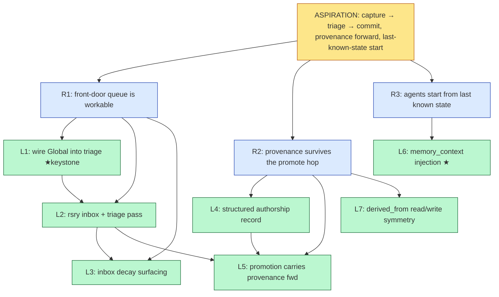

# Problem decomposition — `rosary-capture-commit-spine`

> **Decomposed:** 2026-06-20 by `problem-decomposer`
> **Status:** Draft
> **Refresh after:** 2026-09-20

## Aspiration

Any idea — born in any session, by a human or an agent — lands in rosary's front
door **without first deciding which repo it belongs to**, gets triaged on a
deliberate pass (not classified at capture time), and when promoted to a
dispatchable bead it **carries its full provenance forward**. The agent that
picks it up starts from the **last known state**, not a blank slate. Rosary is
the *commit* end of a capture → triage → commit pipeline, not a per-repo work
tracker that drops or prematurely classifies everything else.

This is a state of the world: today rosary's lifecycle begins at "a committed
bead inside a repo," and the user's sprawl ("experiments/ folders everywhere")
is the symptom of there being no earlier, repo-optional stage.

## Grounding (what already exists — verified in code + live Dolt, 2026-06-20)

The headline finding: **most primitives already exist as types; the spine that
connects them does not.** The backlog the user senses is "collapsible" because
this is wiring, not greenfield.

| Primitive                     | State                         | Evidence                                                                                                                                                               |
| ----------------------------- | ----------------------------- | ---------------------------------------------------------------------------------------------------------------------------------------------------------------------- |
| Repo-optional scope           | **built (types only)**        | `src/scope.rs` `ScopeId::{Repo, External(uri), Global}`; `GLOBAL_REPO="global"`; landed in `rosary-b5da2f` (closed)                                                    |
| Front-door bead               | **filed, unbuilt**            | `rosary-1db9c9` (open) "Incoming triage queue (inbox before bead classification)" — description sketches inbox/ + triage skill + decay                                 |
| Provenance chain on beads     | **built + persisted**         | `Bead.derived_from: Vec<ProvenanceRef>` (`src/bead.rs:278`); persisted via `src/bead_dolt.rs:63,78`; `ProvenanceRef::Session{transcript_path}` exists for Claude turns |
| Capture → provenance          | **built**                     | `src/capture.rs` `capture_from_session`→`Session`, `capture_from_code`→`Code`, set on `BeadSpec`                                                                       |
| Creator identity              | **impoverished**              | `Bead.created_by: Option<String>` = git `user.name` only — no human/agent kind, no session id, no observer/ingester triad (lectio has all three)                       |
| Context injection at dispatch | **built for AST, not memory** | `rsry-461705` (closed) injects ley-line AST context into `AgentTask.ast_context` before dispatch                                                                       |
| Within-rosary phase context   | **built**                     | `src/handoff.rs` `Handoff::format_for_prompt` (phase→phase only)                                                                                                       |

**The wiring gaps (verified absent):**

- `grep 'ScopeId::Global\|External'` in `store_dolt.rs` / `dispatch/mod.rs` /
  `reconcile/mod.rs` / `reconcile/triage.rs` → **empty**. The scope variants are
  never consumed by the storage/triage/dispatch loop.
- Reconcile triages a bead only when `bead.repo` matches a registered config repo
  (`src/reconcile/triage.rs:97-105`). A `Global` bead has `repo == "global"`,
  matches no registered repo → **it is stored but never triaged or dispatched.**
  `rosary-1db9c9` itself is in this limbo.
- No dispatch-time injection of "last known state" memory — only AST (461705).

## 5-Whys descent

### Chain 1 — front-door is storage-only (the root)

```
[ASPIRATION] Ideas flow capture → triage → commit, carrying provenance; agents start from last known state.
   ↑ why isn't it true?
[REQUIREMENT] The Global/inbox scope can store un-triaged ideas, but nothing triages or promotes them.
   ↑ why?
[REQUIREMENT] Reconcile triages only beads whose `repo` matches a registered config repo; `Global` (repo="global") matches none.
   ↑ why?
[REQUIREMENT] The scope abstraction (rosary-b5da2f) landed the *types* (ScopeId::Global/External) but stopped before wiring them into the triage/dispatch loop.
   ↑ why?
[ROOT] Rosary's lifecycle begins at "committed bead in a repo." There is no first-class pre-commit stage (inbox → triaged → promoted), so the scope types have nowhere to be consumed.
```

### Chain 2 — provenance breaks at the promote hop

```
[ASPIRATION] Promoted beads carry full provenance forward.
   ↑ why isn't it true?
[REQUIREMENT] When an inbox item becomes a repo bead, authorship doesn't survive — only a git name does.
   ↑ why?
[REQUIREMENT] `created_by` is a single string (git user.name); it can't say human-vs-agent, which session, or observer-vs-author (the lectio triad).
   ↑ why?
[DISPATCHABLE] Extend creator identity to a structured authorship record + copy it forward on promotion.
```

### Chain 3 — agents start from a blank slate

```
[ASPIRATION] The agent picking up a bead starts from the last known state.
   ↑ why isn't it true?
[REQUIREMENT] Dispatch injects AST context (461705) but no memory / "last known state" for the bead's scope.
   ↑ why?
[REQUIREMENT] The injection seam (`AgentTask.ast_context`) was built single-purpose for ley-line AST; there's no sibling memory channel.
   ↑ why?
[DISPATCHABLE] Add a `memory_context` injection channel mirroring the proven AST-injection shape.
```

## Requirement lattice

| ID  | Requirement                                                                        | Parent(s)  | Child(ren) |
| --- | ---------------------------------------------------------------------------------- | ---------- | ---------- |
| R1  | Front-door queue is *workable*, not just storable (Global beads get a triage pass) | Aspiration | L1, L2, L3 |
| R2  | Provenance survives the capture → promote hop (authorship triad + chain)           | Aspiration | L4, L5, L7 |
| R3  | Dispatched agents start from last known state (memory injection)                   | Aspiration | L6         |

## Dispatchable leaves

### L1 — `Wire ScopeId::Global into reconcile triage`

- **Aspiration root:** capture→triage→commit spine.
- **Why chain:** L1 → R1 → Aspiration.
- **Problem statement:** Reconcile's triage skips beads whose `repo` doesn't match a
  registered config repo (`src/reconcile/triage.rs:97-105`), so `Global`-scope beads
  (`repo == GLOBAL_REPO == "global"`, see `src/scope.rs`) are stored but never
  triaged or dispatched. Make the reconciler recognize `repo == "global"` as a valid
  virtual scope and include those beads in the triage pass. Global beads physically
  live in rosary's existing Dolt store (e.g. `rosary-1db9c9` is there today with
  prefix `rosary-`), so this is a recognition fix, not a new store.
- **Acceptance criteria:** New test in `src/reconcile/` (or `tests.rs`) seeds a bead
  with `repo="global"` and asserts triage selects it (not held by the
  registered-repo gate). `cargo test --bin rsry reconcile` green; existing triage
  tests stay green.
- **Inputs:** `src/scope.rs` (`ScopeId::Global`, `GLOBAL_REPO`, `WorkRef`),
  `src/reconcile/triage.rs:46-210`, `src/reconcile/mod.rs:231` (repo loop).
- **Expected output shape:** Diff against `triage.rs` + `reconcile/mod.rs` + one new
  test. < 150 lines.
- **Scope boundary:** Only triage *recognition* of Global scope. The capture command
  and the triage-classification pass are L2. Dispatch execution of a promoted bead
  already works once it has a real repo.
- **Failure mode:** Test exit code ≠ 0; or a global bead still absent from the triage
  candidate set.
- **Time-box:** M.
- **Suggested target repo:** rosary.
- **Suggested priority:** P1.
- **Depends on:** none. *This is the keystone.*

### L2 — `rsry inbox capture + rsry triage pass (implements rosary-1db9c9)`

- **Aspiration root:** capture→triage→commit spine.
- **Why chain:** L2 → R1 → Aspiration.
- **Problem statement:** Implement the front-door queue from `rosary-1db9c9`: a
  capture-fast command (`rsry inbox "<one-liner>"`) that appends an un-classified
  item to the Global scope with `ProvenanceRef::Session` provenance (no
  classification required), and a triage pass (`rsry triage`) that lists queue items
  and proposes a per-item action (file-as-bead / merge-into-existing / kill / defer /
  promote-to-ADR), reusing `epic::is_dominated_by` for dedup against existing beads so
  the inbox doesn't double-file.
- **Acceptance criteria:** `rsry inbox "test idea"` creates a Global-scope item;
  `rsry triage --json` lists it with a proposed classification and any dedup matches.
  Unit tests for capture-append and for the dedup-on-triage path pass.
- **Inputs:** `src/capture.rs` (provenance pattern), `src/scope.rs` (`ScopeId::Global`),
  `src/epic.rs` (`is_dominated_by`), `src/main.rs` (CLI subcommand wiring),
  `rosary-1db9c9` description (the spec).
- **Expected output shape:** New `src/inbox.rs` (or extend `capture.rs`) + 2 CLI
  subcommands + tests. New file at `src/inbox.rs`; diff to `main.rs`. < 400 lines.
- **Scope boundary:** Capture + list + propose. *Executing* the proposed action
  (actually promoting) is L5. Decay surfacing is L3.
- **Failure mode:** Test exit ≠ 0; `rsry triage` returns empty when an item exists.
- **Time-box:** M (lean toward L if dedup wiring is fiddly — decompose then).
- **Suggested target repo:** rosary.
- **Suggested priority:** P1.
- **Depends on:** L1.

### L3 — `Inbox decay surfacing`

- **Aspiration root:** capture→triage→commit spine.
- **Why chain:** L3 → R1 → Aspiration.
- **Problem statement:** Per `rosary-1db9c9`, items in the Global queue older than N
  days that haven't been triaged should be auto-surfaced. Add a `--stale-days N`
  (default from config) filter to `rsry triage` that flags overdue items distinctly.
- **Acceptance criteria:** Test: an item with `created_at` older than N is flagged
  `stale` in `rsry triage --json`; a fresh one isn't.
- **Inputs:** L2's `rsry triage` impl, `Bead.created_at`, config for default N.
- **Expected output shape:** Small diff to the triage command + 1 test. < 80 lines.
- **Scope boundary:** Surfacing only — no auto-action on stale items.
- **Failure mode:** Test exit ≠ 0.
- **Time-box:** S.
- **Suggested target repo:** rosary.
- **Suggested priority:** P3.
- **Depends on:** L2.

### L4 — `Structured authorship record (human/agent/session)`

- **Aspiration root:** provenance survives the hop.
- **Why chain:** L4 → R2 → Aspiration.
- **Problem statement:** `Bead.created_by` is a bare git `user.name` string and can't
  distinguish human vs agent, carry a session id, or model lectio's
  author/observer/ingester triad. Add a structured authorship field (e.g.
  `authored_by: Option<Authorship>` with `actor`, `kind: Human|Agent`, `session_id`,
  optional `observer`) that is backward-compatible (serde `default`, `created_by`
  retained). Capture commands populate it from the session.
- **Acceptance criteria:** serde round-trip test (old beads without the field
  deserialize; new beads round-trip). `capture_from_session` sets `kind=Agent` +
  `session_id`. `cargo test --bin rsry` green.
- **Inputs:** `src/bead.rs:237-280` (Bead struct), `src/bead_dolt.rs` (persistence),
  `src/capture.rs`, lectio's authorship model (`~/github/jamestexas/lectio` —
  read for the triad shape; do not import).
- **Expected output shape:** Diff to `bead.rs` + `bead_dolt.rs` + `capture.rs` + tests.
  New `Authorship` type. < 250 lines.
- **Scope boundary:** Schema + capture population only. *Copying it forward on
  promotion* is L5. Linear/GitHub mirroring of authorship is out of scope.
- **Failure mode:** Round-trip test exit ≠ 0; old-bead deserialization breaks.
- **Time-box:** M.
- **Suggested target repo:** rosary.
- **Suggested priority:** P2.
- **Depends on:** none (parallel with L1).

### L5 — `Promotion carries provenance + authorship forward`

- **Aspiration root:** provenance survives the hop (also serves R1).
- **Why chain:** L5 → R2 (+R1) → Aspiration.
- **Problem statement:** When a Global inbox item is promoted to a repo bead (the
  "file-as-bead" / "promote" triage action from L2), copy `derived_from` and the L4
  `authored_by` from the inbox item onto the new bead, and append a
  provenance entry recording the promotion itself (inbox-item → bead).
- **Acceptance criteria:** Test: promote an inbox item with `Session` provenance +
  `Agent` authorship → the resulting repo bead has both, plus a promotion entry.
- **Inputs:** L2 (triage/promote action), L4 (`Authorship`), `Bead.derived_from`,
  `ProvenanceRef` variants (`crates/bdr/src/provenance.rs`).
- **Expected output shape:** Diff to the promote path + 1 test. < 150 lines.
- **Scope boundary:** The data hop only — not the triage UX (L2) or schema (L4).
- **Failure mode:** Test exit ≠ 0; promoted bead missing provenance/authorship.
- **Time-box:** S.
- **Suggested target repo:** rosary.
- **Suggested priority:** P2.
- **Depends on:** L2, L4.

### L6 — `Add memory_context injection channel at dispatch`

- **Aspiration root:** agents start from last known state.
- **Why chain:** L6 → R3 → Aspiration.
- **Problem statement:** `rsry-461705` (closed) proved the dispatch-time injection
  pattern by querying ley-line for AST context and injecting into
  `AgentTask.ast_context`. Add a sibling `memory_context` field populated from a
  memory source (lectio MCP, or a file/CLI fallback) keyed by the bead's scope, so the
  agent's starting prompt includes the last known state. Gate behind a config flag
  (default off) so the policy question ("do we always inject?") is decided
  empirically, not up front. Empty-safe: no source / no hits → no memory block, no
  error.
- **Acceptance criteria:** Test: with a stub memory source returning content, the
  built dispatch prompt contains a `memory_context` block; with no source it's absent
  and dispatch still succeeds. `cargo test --bin rsry dispatch` green.
- **Inputs:** `src/dispatch/mod.rs` (AgentTask construction, prompt build), the
  `rsry-461705` AST-injection code as the template, lectio MCP tool surface
  (`mcp__lectio__memory_search` / `memory_window`), config for the flag + source.
- **Expected output shape:** Diff to `dispatch/mod.rs` + AgentTask + tests. New config
  field. < 300 lines.
- **Scope boundary:** The injection *mechanism* + flag. Choosing the always-on policy,
  and the HDC-vs-baseline ranking of *what* to inject, are out of scope (the latter is
  a separate aspiration that lives in lectio).
- **Failure mode:** Test exit ≠ 0; dispatch errors when memory source is absent.
- **Time-box:** M.
- **Suggested target repo:** rosary.
- **Suggested priority:** P2.
- **Depends on:** none (parallel; reuses 461705 pattern).

### L7 — `Reconcile derived_from read/write path symmetry`

- **Aspiration root:** provenance survives the hop.
- **Why chain:** L7 → R2 → Aspiration.
- **Problem statement:** `src/bead.rs:275-278` documents `derived_from` as "populated
  from the notes JSON at read time," while `src/bead_dolt.rs:63,78` takes it as a
  write parameter. Confirm the read path and write path agree (no silent drop), and
  add a round-trip test that writes a bead with multi-entry `derived_from` and reads
  it back identical.
- **Acceptance criteria:** Round-trip test passes; if a mismatch exists, the fix makes
  read == write. `cargo test --bin rsry` green.
- **Inputs:** `src/bead.rs`, `src/bead_dolt.rs`, `src/store_dolt.rs`.
- **Expected output shape:** 1 test + (if needed) a small read/write fix. < 120 lines.
- **Scope boundary:** Just `derived_from` persistence symmetry. Not the authorship
  field (L4).
- **Failure mode:** Round-trip test exit ≠ 0.
- **Time-box:** S.
- **Suggested target repo:** rosary.
- **Suggested priority:** P3.
- **Depends on:** none.

## Non-leaves queue

| Title                                                                           | Fails property                                                            | What would unblock                                                                                                                                                                                              |
| ------------------------------------------------------------------------------- | ------------------------------------------------------------------------- | --------------------------------------------------------------------------------------------------------------------------------------------------------------------------------------------------------------- |
| Extract shared Rust client libs (Linear/GitHub) used by rosary + lectio + notme | #4 (output shape — crate boundary undefined), #5 (cross-repo unbounded)   | Write an ADR naming the shared crate + which layer it owns (transport + types, **not** sync policy — rosary writes Linear bidirectionally, lectio only reads). Then one extraction leaf per client.             |
| Distill / dedupe-as-HDC-experiment stage                                        | #1, #2 (belongs to lectio, not rosary; criteria are an experiment design) | Separate aspiration (`falsifiable-semantic-search`). Rosary's slice is L2's `is_dominated_by` dedup-on-triage; the HDC ranking is upstream in lectio. Don't file under this aspiration.                         |
| "Auto-inject context by default?" policy                                        | #2 (no falsifiable "done" — it's a judgment)                              | L6 ships the mechanism behind a flag (default off). After it's observable in real dispatches, decide the policy as a follow-up bead with acceptance = "config default flips + N dispatches show no regression." |
| `chat-log capture → cloister CAS` (`rosary-125fc1`, open)                       | #3 (depends on cloister CAS contract not yet stable)                      | Blocked on the cloister content-addressed-storage seam. Re-evaluate once that lands; then it becomes the durable backing for L2's capture.                                                                      |

## Lattice (Mermaid)



L5 is the lattice signal — it serves both R1 (the triage→promote flow) and R2
(provenance survival) and depends on L2 and L4 from different branches.

## Action items

- File L1 first — it's the keystone and unblocks the whole R1 branch. Maps onto
  the existing open bead `rosary-1db9c9` (L1+L2+L3 *implement* it; consider
  retitling 1db9c9 as the R1 epic and filing L1/L2/L3 as its children).
- File L4 and L6 in parallel — both are independent of L1.
- Track the non-leaves separately; the shared-client-libs ADR is the gate for
  that whole thread.
- Refresh after L1+L2 land — the triage pass usually reveals second-order
  requirements (priority heuristics, merge-vs-file rules) not visible until the
  inbox has real traffic.

## Backlog collapse (existing beads this subsumes / relates to)

- `rosary-1db9c9` (open) → **implemented by** L1+L2+L3.
- `loom-2m3` (open, `/btw` mid-conversation capture) → an *on-ramp* to L2's inbox;
  re-point at `rsry inbox` once L2 lands.
- `rosary-125fc1` (open, chat-log → CAS) → durable backing for L2 capture; non-leaf
  until cloister CAS stabilizes.
- `rsry-461705` (closed, AST injection) → L6 is its sibling/extension.
- `rosary-39fbb2` (open, multi-tenant dispatch attribution) → consumes L4 authorship.
- `rosary-b5da2f` (closed, scope abstraction) → the foundation L1 builds on.

## Cross-references

- Skill: `/Users/jamesgardner/.claude/skills/problem-decomposer/`
- Dispatchability rubric: `DISPATCHABILITY.md`
- Anchoring beads: `rosary-1db9c9`, `rsry-461705`, `rosary-b5da2f`, `rosary-d7cc72`
- Provenance model: `crates/bdr/src/provenance.rs`, `src/bead.rs`, `src/capture.rs`
- Scope abstraction: `src/scope.rs`
