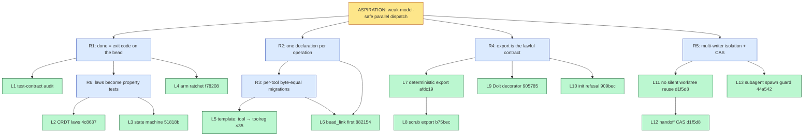

# Problem decomposition — `test-gated-dispatch`

> **Decomposed:** 2026-07-29 by `problem-decomposer`
> **Status:** Draft
> **Refresh after:** 2026-10-29 (or after the first leaf batch closes)

## Aspiration

Rosary's backlog is a machine that weaker models can safely operate in parallel:
every dispatchable bead carries a test the implementing agent must satisfy, so
correctness is checked by the suite rather than by the model's judgment; every
command surface (CLI, MCP schema, server.json) derives from one declaration, so
backends and entrypoints cannot drift apart; and an ordinary interactive session
(Claude Code, codex) that spawns subagents cannot corrupt shared bead or
workspace state. When this is true, dispatch scales with the number of
non-overlapping test contracts, not with the strength of any single model.

## 5-Whys descent

### Chain 1 — test contracts on beads

```
[ASPIRATION] weak models validated by tests, not judgment
   ↑ why?
[REQUIREMENT] a bead is dispatchable to a weak model only if "done" is a command exit code
   ↑ why?
[REQUIREMENT] acceptance must be an executable test contract, present on the bead itself
   ↑ why?
[DISPATCHABLE] L1 audit the open backlog for test-contract coverage
[DISPATCHABLE] L2 CRDT algebra property tests (rosary-4c8637)
[DISPATCHABLE] L3 bead state-machine property test (rosary-51818b)
[DISPATCHABLE] L4 arm the coverage ratchet (rosary-f78208)
```

### Chain 2 — one declaration, N surfaces

```
[ASPIRATION] backends/entrypoints cannot drift
   ↑ why?
[REQUIREMENT] CLI and MCP are projections of ONE declaration (toolreg, rosary-08a278)
   ↑ why?
[REQUIREMENT] every tool migrates into toolreg behind a byte-equal gate (#448 proved the shape)
   ↑ why?
[DISPATCHABLE] L5..Ln one leaf PER TOOL: migrate tool X into toolreg, byte-equal test green
[DISPATCHABLE] L6 rsry_bead_link first (fixes rosary-882154 dep_type schema drift en passant)
```

This chain is the parallelism goldmine: ~35 near-identical, non-overlapping,
mechanically-gated migrations — the ideal weak-model fleet shape.

### Chain 3 — store convergence (the "subtle backend differences")

```
[ASPIRATION] behavior identical regardless of backend/setup
   ↑ why?
[REQUIREMENT] one store family; projections lawful and deterministic
   ↑ why?
[REQUIREMENT] the export is the contract: deterministic bytes, no leaks, decorator on every path
   ↑ why?
[DISPATCHABLE] L7 deterministic export (rosary-afdc19)
[DISPATCHABLE] L8 scrub soft-deleted comments from export (rosary-b75bec)
[DISPATCHABLE] L9 wrap the Dolt store in the publish decorator (rosary-905785)
[DISPATCHABLE] L10 init refuses bd-era embeddeddolt repos (rosary-909bec)
```

Already shipped on this chain (evidence the technique works): round-trip
property (#434, `rosary-c45a35`), merge-driver laws (`rosary-4ca8a5`),
provenance-in-export (`rosary-79393f`).

### Chain 4 — session-safe subagent spawn

```
[ASPIRATION] interactive sessions spawning subagents cannot corrupt shared state
   ↑ why?
[REQUIREMENT] workspace + handoff writes need isolation and CAS, like coordination::append already has
   ↑ why?
[DISPATCHABLE] L11 Workspace::create never silently reuses a live worktree (rosary-d1f5d8 half 1)
[DISPATCHABLE] L12 handoff writes use CAS (rosary-d1f5d8 half 2)
[DISPATCHABLE] L13 subagent-spawn worktree guard hook (rosary-44a542)
```

## Requirement lattice

| ID | Requirement | Parent(s) | Child(ren) |
|----|-------------|-----------|------------|
| R1 | Done = command exit code, carried on the bead | aspiration | L1, L2, L3, L4 |
| R2 | One declaration per operation; CLI/MCP are projections (toolreg) | aspiration | R3, L6 |
| R3 | Per-tool migration behind byte-equal gates | R2 | L5 (template ×~35) |
| R4 | Export is the lawful contract between stores/machines | aspiration | L7, L8, L9, L10 |
| R5 | Multi-writer safety: isolation + CAS everywhere agents write | aspiration | L11, L12, L13 |
| R6 | Untested invariants become property tests (docs/design/2026-07-28-property-test-map.md) | R1 | L2, L3 |

Note the lattice edges: L2/L3 serve both R1 (test contracts) and R6 (property
map); L6 serves both R3 (migration) and the `rosary-882154` bug fix; L7 serves
R4 and is the precondition for content-addressed identity (ADR-0020).

## Dispatchable leaves

### L1 — Audit every open bead for a test contract; comment the gap on each

- **Why chain:** L1 → R1 → Aspiration
- **Problem statement:** For each open non-epic bead in rosary's store, check whether `acceptance_criteria` names a runnable command (or a test to write). Where it doesn't, append a comment `TEST-CONTRACT MISSING: <what a falsifiable acceptance would be>` derived from the description. Do not close or edit anything else.
- **Acceptance criteria:** a report at `docs/problems/test-contract-audit-<date>.md` listing every open bead as PASS/GAP with the proposed contract; every GAP bead carries the comment.
- **Inputs:** `.beads/beads.jsonl`, `rsry bead list/comment`, `DISPATCHABILITY.md` property #2.
- **Expected output shape:** one markdown report + N bead comments; zero code changes.
- **Scope boundary:** no bead status changes; no new beads.
- **Failure mode:** report missing, or a GAP bead without its comment.
- **Time-box:** M. **Repo:** rosary. **Priority:** P1. **Depends on:** —

### L2 — Property-test the four CRDT algebra laws (`rosary-4c8637`, exists)

- **Why chain:** L2 → R6 → R1 → Aspiration
- **Problem statement:** `src/observation/algebra_*.rs` implement chain-max, LWW-register, OR-set, flat-lattice. Zero commutativity/associativity/idempotence tests exist. Write proptest laws per algebra: `fold(shuffle(xs)) == fold(xs)`, `merge(a,merge(b,c)) == merge(merge(a,b),c)`, `merge(a,a) == merge(a)`.
- **Acceptance criteria:** `cargo test --bin rsry observation::algebra` green with ≥3 law tests per algebra; mutation check: breaking commutativity in any one algebra fails a test.
- **Inputs:** `src/observation/algebra_*.rs`, `src/observation/fold.rs`, proptest (already a dev-dep — verify in Cargo.toml, else add).
- **Expected output shape:** test-only diff, one new test module per algebra, < 400 lines.
- **Scope boundary:** no production code changes unless a law genuinely fails — then STOP and file the finding as a bead instead of fixing.
- **Failure mode:** test exit code; a discovered law violation is reported `[stuck]`, not patched.
- **Time-box:** S–M. **Repo:** rosary. **Priority:** P0 (already filed). **Depends on:** —

### L3 — Property-test the bead state machine (`rosary-51818b`, exists)

- Same shape as L2 against the transition table (`src/bead.rs` BeadState): no sequence of legal transitions reaches a stuck non-terminal state; terminal states unreachable except through the deliberate verbs (`close`, `correct`).
- **Acceptance:** named proptest green; mutation check: adding an illegal edge fails.
- **Time-box:** S. **Priority:** P1. **Depends on:** —

### L4 — Arm the coverage ratchet (`rosary-f78208`, exists)

- **Problem statement:** the ratchet has been green-and-enforcing-nothing since it was built (found as a vacuous gate). Set the floor to current measured coverage and make lowering it fail `task coverage`.
- **Acceptance criteria:** prove the gate can fail: a commit deleting one test's assertions makes `task coverage` exit non-zero; restoring makes it green.
- **Inputs:** `Taskfile.yml` coverage task, CI `coverage.yml`.
- **Failure mode:** the prove-it-fails step is in the PR description with output, per the LLO handoff rule ("prove a gate can fail by making it fail").
- **Time-box:** S. **Priority:** P0. **Depends on:** —

### L5 — TEMPLATE: migrate tool `<X>` into toolreg behind a byte-equal gate

- **Why chain:** L5 → R3 → R2 → Aspiration
- **Problem statement:** Move tool `<X>`'s argument declaration into `src/toolreg/` as one annotated struct (clap + schemars, the #448 pattern). The MCP inputSchema and CLI arg surface project from it. The byte-equal test pins that the generated schema matches the previously-advertised one exactly (or documents the intentional diff, e.g. adding a field the handler already supported).
- **Acceptance criteria:** `cargo test --bin rsry toolreg` green including a `<X>_schema_byte_equal` test; `src/parity` gate green; the hand-written schema for `<X>` is DELETED, not shadowed.
- **Inputs:** `src/toolreg/mod.rs` (the pattern + doc comment), `src/serve/tools.rs` (current hand-written schemas), `src/parity/`, the #448 PR as the worked example.
- **Expected output shape:** one struct added, one schema deleted, one test; < 250 lines net.
- **Scope boundary:** ONE tool per bead. File-scope = the tool's struct file + its removal site, so leaves are non-overlapping and fleet-dispatchable in parallel.
- **Failure mode:** byte-equal test fails; parity gate fails.
- **Time-box:** S each. **Priority:** P2 each (P1 for tools with known drift). **Depends on:** none between siblings; all follow L6.

### L6 — First toolreg migration: `rsry_bead_link` (+ advertise `dep_type`, fixes `rosary-882154`)

- L5-shaped, but first, because it retires a live drift bug: the handler reads `dep_type` while the advertised schema omits it, so every link silently defaults to `blocks`. The byte-equal test here pins the NEW (corrected) schema and a regression test drives a `parent-child` link end-to-end.
- **Acceptance:** schema advertises `dep_type`; link with `dep_type=parent-child` persists and round-trips; byte-equal + parity green. Also add the missing CLI `rsry bead link` projection from the same struct (the CLI half of 882154).
- **Time-box:** M. **Priority:** P1. **Depends on:** — (establishes the template for L5 siblings)

### L7 — Deterministic export (`rosary-afdc19`, exists)

- **Problem statement:** two verified nondeterminism sources: dependency arrays unordered (`src/dolt/deps.rs:122,157`, `src/bead_sqlite/mod.rs:1139` — no ORDER BY) and export line order caller-dependent (`src/import.rs:98`). Add `ORDER BY depends_on_id` and sort export lines by bead id.
- **Acceptance criteria:** property test: export twice from the same store state ⇒ identical bytes; export after a no-op write ⇒ identical bytes. `BLAKE3(beads.jsonl)` stable across two consecutive `rsry bead export --jsonl` runs on the live repo.
- **Expected output shape:** ~3 query edits + 1 sort + 1 property test; < 150 lines.
- **Scope boundary:** determinism only; signing (LLO RootSigner) is downstream, not here.
- **Time-box:** S. **Priority:** P1. **Depends on:** — . **Unblocks:** content-addressing/signing (ADR-0020) — the highest-leverage small leaf in this doc.

### L8 — Export excludes soft-deleted comment text (`rosary-b75bec`, exists)

- **Acceptance:** round-trip property extended: soft-deleted comments' `original_text` never appears in `--jsonl` output; a fixture with a scrubbed comment proves it; existing round-trip (#434) still green (deleted-ness itself survives, the text doesn't).
- **Time-box:** S. **Priority:** P1. **Depends on:** L7 (byte-stable baseline makes the diff reviewable).

### L9 — Publish decorator wraps the Dolt store (`rosary-905785`, exists)

- **Acceptance:** a write through `connect_bead_store` on a Dolt-backed fixture refreshes the tracked JSONL; the false doc claim at `src/publish/mod.rs:57` is deleted. ~3 lines + test.
- **Scope boundary:** if `rosary-185161` (retire Dolt) lands first, close this with it — the ordering note is on the bead.
- **Time-box:** S. **Priority:** P1. **Depends on:** —

### L10 — `rsry init` refuses bd-era `embeddeddolt/` repos (`rosary-909bec`, exists)

- **Acceptance:** regression test drives `init_store` against an embeddeddolt-only fixture; asserts no `beads.db` created and the error names the migration path. The silent-warning compounding (`src/bead_sqlite/mod.rs:159`) gets its own assertion.
- **Time-box:** S. **Priority:** P1. **Depends on:** —

### L11 — `Workspace::create` never silently reuses a live worktree (`rosary-d1f5d8` half 1)

- **Problem statement:** `src/workspace/lifecycle.rs:49-64` reuses an existing worktree for a bead. Two concurrent dispatches then share one `work_dir`. Make reuse explicit: refuse with a loud error naming the holder, unless `reuse: true` is passed by the caller that owns it.
- **Acceptance:** test spawns two creates for one bead; second fails with the named-holder error; single-dispatch path unchanged (existing workspace tests green).
- **Time-box:** S. **Priority:** P1. **Depends on:** —

### L12 — Handoff writes use CAS (`rosary-d1f5d8` half 2)

- **Problem statement:** handoff files are plain writes (`src/handoff.rs:261-268`), last-writer-wins silently. `src/coordination/mod.rs:111 append` already implements the correct CAS-retry-loud pattern against git refs. Port the handoff write to that pattern (or an equivalent `O_EXCL`/rename CAS if a ref is wrong for this path — decide in the PR, both are acceptable).
- **Acceptance:** concurrent-writer test: two simultaneous handoff writes ⇒ one succeeds, one gets a loud contention error; no interleaved/lost record.
- **Time-box:** M. **Priority:** P1. **Depends on:** L11 (isolation reduces contention to the true concurrent case).

### L13 — Subagent-spawn worktree guard (`rosary-44a542`)

- **Problem statement:** parallel subagents in one checkout branch-switch/stash-pop each other (82-bead loss incident, `feedback_agents_isolated_worktrees`). Ship the guard as a documented hook: on subagent spawn, allocate an isolated worktree (Claude Code's native `isolation: "worktree"` / EnterWorktree where available; `git worktree add` fallback), and a `PreToolUse` check that refuses `git checkout`/`git stash pop` in a directory registered as shared. Deliverable is the hook script + install docs in rosary (`docs/git-hooks/` sibling), not a Claude Code fork.
- **Acceptance:** hook script exists + installable via `rsry hooks install`; a scripted simulation (two fake agents, one shared dir) shows the second branch-switch refused; docs updated.
- **Scope boundary:** enforcement inside rosary-dispatched agents is already isolated (`src/workspace`); this covers INTERACTIVE sessions. Deeper dispatch/pipeline decoupling is a non-leaf below.
- **Time-box:** M. **Priority:** P1. **Depends on:** —

## Non-leaves queue

| Title | Fails property | What would unblock |
|-------|----------------|---------------------|
| Collapse to one authority — log as truth (`rosary-04d739`) | #2 (gated on four written falsifiers, esp. tombstones) | Answer the falsifiers in writing; ADR-0020's DAG answers absence-vs-deletion |
| Retire the Dolt backend (`rosary-185161`) | #5 (remote-storage + CDC needs must get a new owner pre-deletion) | A one-page owner decision; then decomposes into per-guard removal leaves |
| Decouple PipelineEngine from dispatch so interactive sessions are first-class | #4 (output shape unknown until the seam is drawn) | A short ADR naming the seam (who owns phase state; what a session-without-pipeline writes); `rosary-a124ef` durable-state fix folds in |
| Thread model: single-homed vs multi-homed membership (`rosary-cac78e`) | #2 (the *decision* is missing; the code defects follow from it) | Decide semantics; then ORDER BY + unassign + dedup become 3 S-sized leaves |
| Bead identity from content (ADR-0020 P1+) | #7 (program-sized) | L7 (deterministic bytes) first; then P1 slices per the ADR's own migration plan |
| Timestamp centralization (`rosary-af2c64`) | #5 borderline (5 sites, 2 backends) | Shrinks to S after Dolt retirement removes 3 of 5 sites — sequence behind 185161 |

## Lattice (Mermaid)



## Action items

- [ ] File L1, L11, L12, L13 as new beads (L2/L3/L4/L6/L7/L8/L9/L10 exist — attach these specs as comments so a weak model gets the contract, not just the diagnosis)
- [ ] After L6 lands, mint the L5 siblings in one batch (one bead per remaining tool, generated from `tool_definitions()` — the batch itself is generatable)
- [ ] Track the non-leaves queue; the Dolt-retirement owner decision unblocks the most downstream mass
- [ ] Refresh this doc when the L5 fleet is half done — the parity/toolreg seam will have revealed the CLI-side second-order work

## Cross-references

- Skill: `problem-decomposer`; rubric: `DISPATCHABILITY.md`
- Epics: `rosary-c1f669` (re-declaration class — R2/R3 are its execution), `rosary-fa7167` (location derives from role)
- ADRs: 0006 (tool registry — superseded in direction by toolreg per its own doc comment), 0020 (identity), 0021 (field lifecycle), 0022 (location/role)
- Design docs: `docs/design/2026-07-28-property-test-map.md` (R6's source), `src/toolreg/mod.rs` doc comment (R2's charter), `src/parity/` (the no-drift gate)
- Bug aggregate + smell diagnosis: this session's five-cluster analysis (classes A–E), 2026-07-29
